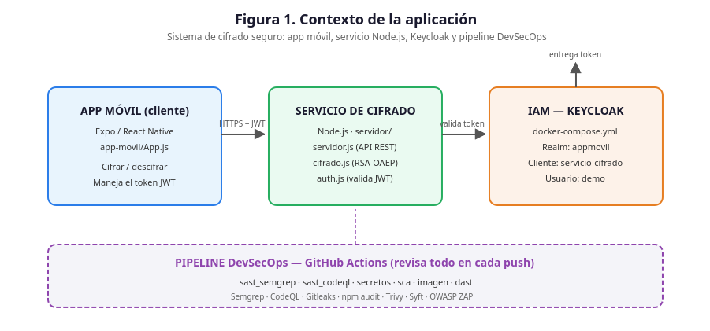
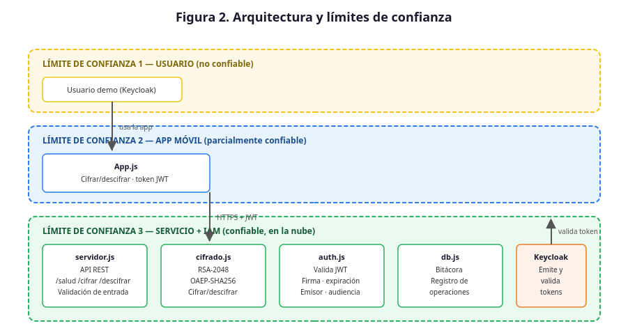
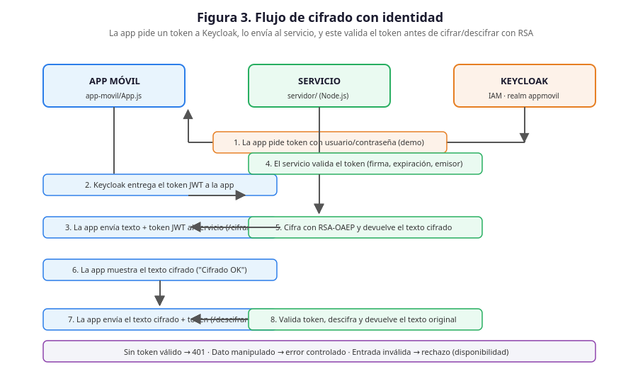
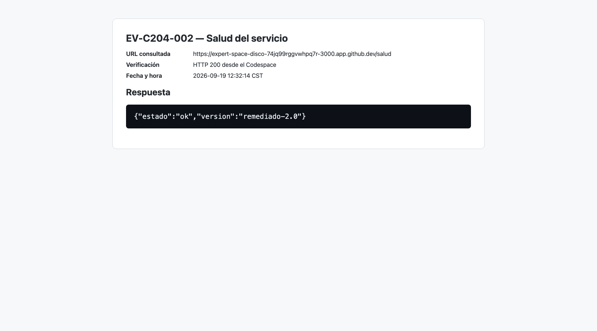
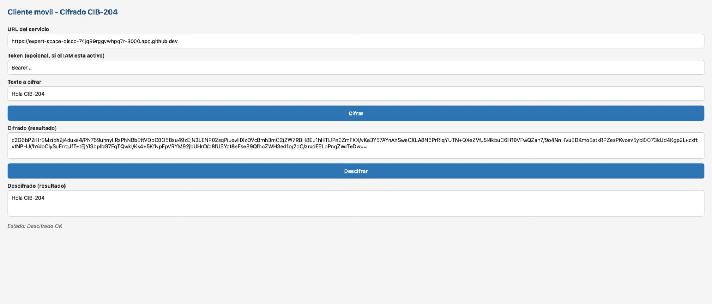
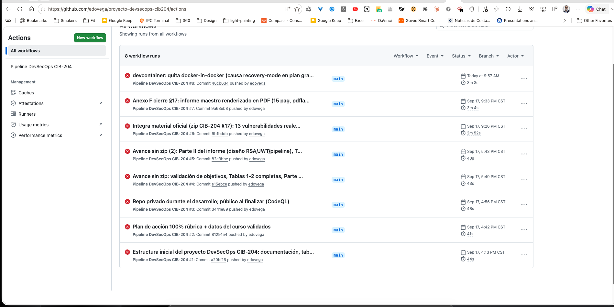
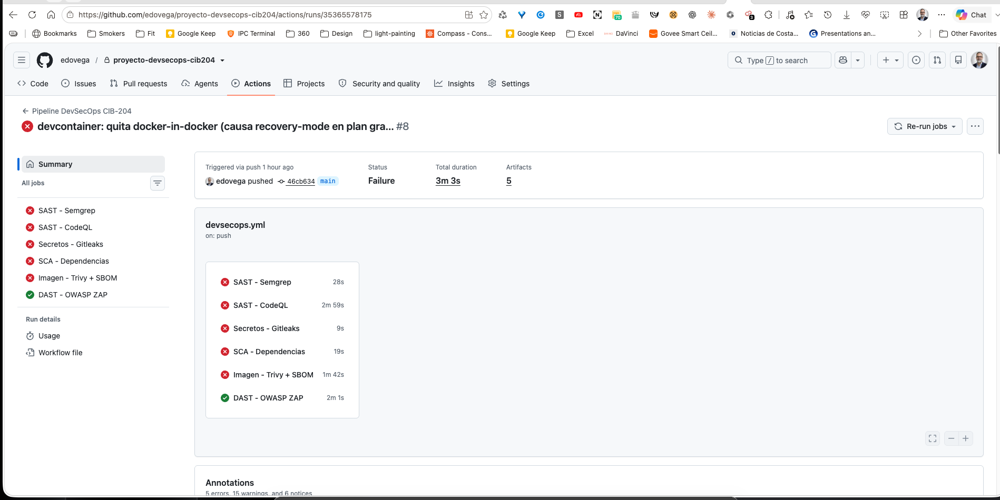
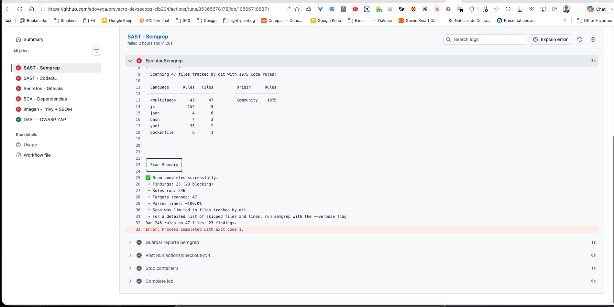

# PROYECTO DE SEGURIDAD EN APLICACIONES MÓVILES — PIPELINE DevSecOps

## Informe integrado: primer avance, segundo avance e informe final

**Curso:** CIB-204 · Seguridad del Software · Maestría en Ciberseguridad
**Universidad:** CENFOTEC · Sede Central
**Profesora:** MsC. Alejandra Corrales Vargas
**Integrantes:** Eduardo J. Vega Arguedas y Keylor Elizondo Rodriguez
**Repositorio:** https://github.com/edovega/proyecto-devsecops-cib204
**Fecha:** 19 de septiembre de 2026
**Código evaluado:** commit `0fc1c11` · **Run verde de referencia:** `35442482331` (5/5 jobs en verde; CodeQL sin alertas abiertas)

> **Cómo leer este informe.** El informe sigue la estructura que exige el curso para el informe final (introducción, desarrollo, resumen de resultados, conclusiones y recomendaciones). Cada afirmación técnica remite a una evidencia `EV-C204-XXX` verificable con `docs/evidencias/manifiesto-sha256.txt`. Lo que no pudo verificarse se indica como **pendiente del equipo** en lugar de darse por hecho.

---

## Mapa del documento

| Parte | Secciones | Entrega |
|---|---|---|
| Parte I — Contexto y diseño | 1–8 | Primer Avance |
| Parte II — Implementación y entorno | 9–12 | Primer Avance |
| Parte III — Diagnóstico y remediación | 13–15 | Segundo Avance |
| Parte IV — Pruebas y riesgos | 16–18 | Segundo Avance |
| Parte V — Cierre académico | 19–23 (resultados, conclusiones, recomendaciones, referencias, cobertura de la rúbrica) | Informe Final |
| Anexos | A–J | Soporte |

## Índice de evidencias

| ID | Evidencia | Archivo (en `docs/evidencias/`) | Estado |
|---|---|---|---|
| EV-C204-001 | Versiones del entorno: `node v20.20.2`, `npm 10.8.2` en el Codespace | `capturas/consola-git/EV-C204-046-screenshot-image4.png` | ✅ (`docker --version` no aparece en la captura) |
| EV-C204-002 | Servicio `/salud` respondiendo en el Codespace | `capturas/EV-C204-002-salud.jpeg` y resumen `EV-C204-002b-resumen-chatgpt.png` (+ transcripción: `EV-C204-023-pruebas-e2e-keycloak.txt`, P-09) | ✅ |
| EV-C204-003 | Keycloak: realm `appmovil` (consola web del Codespace) | `capturas/EV-C204-003-realm.jpeg` (+ datos: `EV-C204-023-pruebas-e2e-keycloak.txt`) | ✅ |
| EV-C204-004 | Keycloak: cliente `servicio-cifrado` (consola web del Codespace) | `capturas/EV-C204-004-cliente.png` (+ datos, ídem) | ✅ |
| EV-C204-005 | Keycloak: usuario `demo` (consola web del Codespace) | `capturas/EV-C204-005-usuario.png` (+ datos: `EV-C204-023-pruebas-e2e-keycloak.txt`) | ✅ |
| EV-C204-006 | App móvil cifrando/descifrando en el Codespace | `capturas/EV-C204-006-app.png` | ✅ |
| EV-C204-007 | Pipeline Fase 1 (jobs en rojo) | `capturas/consola-git/EV-C204-047…051, 033…036` (ver §13 y Anexo I) | ✅ |
| EV-C204-008 | Reporte Semgrep del **run verde** (Fase 2) | `capturas/EV-C204-008-semgrep.json` | ✅ |
| EV-C204-009 | Reporte Gitleaks del **run verde** (Fase 2) | `capturas/EV-C204-009-gitleaks.json` | ✅ |
| EV-C204-010 | SBOM del **run verde** (Fase 2) | `capturas/EV-C204-010-sbom.json` | ✅ |
| EV-C204-011 | Informe ZAP del **run verde** (Fase 2) | `capturas/EV-C204-011-zap.html` | ✅ |
| EV-C204-012 | Alertas CodeQL (Code scanning): 0 abiertas, 3 cerradas | `capturas/EV-C204-012-codeql-alertas.png` (+ datos: `EV-C204-025-codeql-alertas.json`) | ✅ |
| EV-C204-013 | Pipeline Fase 2 (todo verde), run #27 (35442482331) | `capturas/EV-C204-013-pipeline-verde.png` (+ transcripción: `EV-C204-026-run-verde.txt`) | ✅ |
| EV-C204-014 | Rama `main` protegida (ruleset `proteger-main`) | `capturas/EV-C204-014-proteccion.png` (+ configuración: `EV-C204-030-ruleset-main.json`) | ✅ |
| EV-C204-015 | Figura 1. Contexto de la aplicación | `figuras/figura-1-contexto.svg` | ✅ |
| EV-C204-016 | Figura 2. Arquitectura y límites de confianza | `figuras/figura-2-arquitectura.svg` | ✅ |
| EV-C204-017 | Figura 3. Flujo de cifrado con identidad | `figuras/figura-3-flujo.svg` | ✅ |
| EV-C204-018 / 019 | Capturas de consola del equipo (PPTX y PDF originales) | `capturas/EV-C204-018-…pptx`, `EV-C204-019-…pdf` | ✅ |
| EV-C204-020 | Artefacto `reporte-gitleaks` de la **Fase 1** (run 35365578175) | `capturas/EV-C204-020-reporte-gitleaks.zip` | ✅ |
| EV-C204-021 | Artefacto `reporte-semgrep` de la **Fase 1** | `capturas/EV-C204-021-reporte-semgrep.zip` | ✅ |
| EV-C204-022 | Artefacto `reporte-zap` de la **Fase 1** | `capturas/EV-C204-022-reporte-zap.zip` | ✅ |
| EV-C204-023 | Pruebas extremo a extremo con Keycloak real (25 comprobaciones) | `capturas/EV-C204-023-pruebas-e2e-keycloak.txt` | ✅ |
| EV-C204-024 | Pruebas Jest (22), ESLint y `npm audit` | `capturas/EV-C204-024-pruebas-unitarias.txt` | ✅ |
| EV-C204-025 | Alertas y análisis de CodeQL | `capturas/EV-C204-025-codeql-alertas.json` | ✅ |
| EV-C204-026 | Run verde de referencia (jobs, artefactos, CodeQL) | `capturas/EV-C204-026-run-verde.txt` | ✅ |
| EV-C204-027 | SBOM de la **Fase 1** (comprimido) | `capturas/EV-C204-027-sbom-fase1.zip` | ✅ |
| EV-C204-028 | Log de los jobs en rojo de la Fase 1 (secretos redactados) | `capturas/EV-C204-028-log-fase1-jobs-rojos.txt` | ✅ |
| EV-C204-029 | Historial de las 22+ ejecuciones del pipeline | `capturas/EV-C204-029-historial-runs.txt` | ✅ |
| EV-C204-033 … 051 | 19 capturas de pantalla del equipo, individualizadas | `capturas/consola-git/` (Anexo I) | ✅ |
| EV-C204-030 | Configuración real del ruleset `proteger-main` (API de GitHub) | `capturas/EV-C204-030-ruleset-main.json` | ✅ |
| EV-C204-052 / 053 | Copias del PPTX y PDF dentro de `consola-git/` | `capturas/consola-git/` | ✅ (duplicados de 018 y 019) |

> Los identificadores 031–032 no se usan. Las etiquetas «EV-C204-006 … 011» que aparecen dentro de las diapositivas del PPTX original son notas internas del equipo y **no** corresponden a este índice; la equivalencia está en el Anexo I.

---

# PARTE I — CONTEXTO Y DISEÑO

## 1. Introducción

El presente proyecto desarrolla un **pipeline DevSecOps completo** para una aplicación móvil de cifrado de datos. La aplicación móvil actúa como cliente; el cifrado ocurre en un servicio backend desarrollado en **Node.js**; la identidad de los usuarios la gestiona **Keycloak** (IAM); y un pipeline de **GitHub Actions** ejecuta seis pruebas de seguridad automáticas en cada cambio del código.

La característica distintiva del laboratorio es que el proyecto **arranca inseguro a propósito**: contiene errores de seguridad reales (secretos quemados, dependencias vulnerables, validación deficiente de tokens, CORS abierto, entre otros), marcados en el código con comentarios `// [VULN-n]`. El pipeline los detecta automáticamente y el trabajo del estudiante consiste en corregirlos uno por uno hasta dejar todas las pruebas en verde.

La metodología sigue el ciclo **DevSecOps**: *detectar → corregir → volver a probar*. En la **Fase 1 (Diagnóstico)** se sube el proyecto tal cual y se documentan todos los hallazgos en rojo; en la **Fase 2 (Remediación)** se corrige cada error, se sube el cambio y se verifica la transición de rojo a verde. Este ciclo automatizado es el valor central del laboratorio: no basta con encontrar los errores, sino que el proceso garantiza que las correcciones se verifican de forma reproducible.

El marco de referencia del proyecto combina **NIST SSDF** (Secure Software Development Framework) para las prácticas del ciclo de vida seguro, **OWASP SAMM** para la madurez del proceso, **OWASP ASVS** y **OWASP MASVS** para los requisitos de seguridad verificables, y **STRIDE** para el modelado de amenazas.

## 2. Objetivos

### 2.1 Objetivo general
Implementar un pipeline DevSecOps completo para una aplicación móvil de cifrado —desde el análisis de requerimientos y el modelado de amenazas hasta el diagnóstico automatizado de vulnerabilidades y su remediación verificada—, dejando el pipeline en verde y documentando todo el proceso con evidencia.

### 2.2 Objetivos específicos
1. **Analizar los requerimientos de seguridad** de la aplicación móvil (confidencialidad, integridad, disponibilidad y autenticación), justificando cada uno y mapeándolos a estándares (OWASP SAMM, NIST SSDF, ASVS, MASVS).
2. **Modelar las amenazas** del sistema con STRIDE, identificando componente afectado, ejemplo de ataque, control y severidad por amenaza.
3. **Configurar el entorno de desarrollo en la nube** (GitHub Codespaces) con Node.js 20 y Docker, documentando la configuración paso a paso.
4. **Implementar el módulo de cifrado RSA** (padding OAEP) en el servicio backend, con funciones de utilidad de validación de entrada y manejo de errores.
5. **Configurar la identidad** con Keycloak (realm, cliente y usuario) y verificar el flujo completo de cifrado/descifrado con token.
6. **Ejecutar el pipeline de seis pruebas de seguridad** (SAST ×2, secretos, SCA, imagen y DAST) y documentar los hallazgos de la Fase 1.
7. **Corregir las vulnerabilidades** en la Fase 2, verificando la transición de rojo a verde con trazabilidad por commit.
8. **Calcular los riesgos** de las vulnerabilidades con método probabilístico (P×I) y análisis gerencial (ALE).
9. **Documentar todas las pruebas** realizadas (funcionales, del pipeline, pentest y automatizadas) con datos de entrada, esperado y real.
10. **Proteger la rama principal** y entregar el informe integrado en PDF con todas las tablas consolidadas.

## 3. Alcance, supuestos y reglas de compromiso

### 3.1 Alcance
- **App móvil (cliente):** aplicación Expo/React Native que cifra y descifra datos y maneja el token.
- **Servicio de cifrado (backend):** API Node.js con endpoints `/salud`, `/cifrar` y `/descifrar`, módulo RSA y validación de token.
- **IAM:** Keycloak que entrega y valida tokens JWT.
- **Pipeline DevSecOps:** seis pruebas automáticas en GitHub Actions.
- **Documentación:** informe integrado, tablas 1–6, evidencias y plantilla de diagnóstico.

### 3.2 Supuestos
- El entorno de desarrollo es **GitHub Codespaces** (imagen Node 20); el pipeline corre en GitHub Actions (`ubuntu-latest`).
- El repositorio se mantuvo **privado durante el desarrollo inicial** (así se ve en las capturas de la Fase 1) y hoy es **público**, requisito para que CodeQL sea gratuito y el docente pueda revisarlo.
- Los secretos del laboratorio son **ficticios, de práctica** (la llave AWS es la de ejemplo de la documentación de AWS); no se subieron secretos reales.
- **CodeQL** corre mediante el *default setup* de GitHub y no como job del workflow (ver §8.6 y §12.1): son mutuamente excluyentes en el mismo repositorio.
- Las pruebas funcionales con identidad se ejecutaron contra un **Keycloak 24.0 real en Docker local**; las capturas de la consola de Keycloak y de la app móvil dentro del Codespace quedan como pendientes del equipo.

### 3.3 Reglas de compromiso
- **Permitido:** ejecutar el laboratorio en el Codespace, generar y eliminar llaves de prueba, cifrar/descifrar datos de demostración, ejecutar el pipeline y descargar reportes.
- **Prohibido:** usar llaves o credenciales reales, subir secretos al repositorio, ejecutar el pentest contra sistemas de terceros, publicar el repositorio con datos sensibles.

## 4. Metodología

### 4.1 Ciclo DevSecOps
El proyecto sigue el ciclo **detectar → corregir → volver a probar**:

1. **Fase 1 — Diagnóstico:** se sube el proyecto inseguro, el pipeline se ejecuta solo y se documentan todos los hallazgos en rojo (Tabla 3).
2. **Fase 2 — Remediación:** se corrige cada hallazgo (un commit por corrección), se sube el cambio y se verifica la transición a verde (Tabla 4).
3. **Cierre:** pentest, cálculo de riesgos (Tabla 5), documentación de pruebas (Tabla 6), protección de la rama principal e informe final.

### 4.2 Marco de referencia
| Marco | Aporte al proyecto |
|---|---|
| **NIST SSDF** (SP 800-218) | Prácticas del ciclo de vida seguro: definir requisitos (PW.4), implementar código seguro (PW.5–7), verificar (RV.1–3) |
| **OWASP SAMM** | Madurez del proceso DevSecOps: estrategia, diseño seguro, implementación, verificación, operaciones |
| **OWASP ASVS** | Requisitos de seguridad verificables (autenticación, validación, criptografía, errores, cabeceras) |
| **OWASP MASVS** | Requisitos específicos de aplicaciones móviles |
| **STRIDE** (Microsoft) | Modelado de amenazas por categoría |
| **CWE** | Identificación precisa de debilidades en los hallazgos |

### 4.3 Reproducibilidad
Todo el entorno es reproducible: `.devcontainer/devcontainer.json` define el Codespace (Node 20 + Docker); `docker-compose.yml` define el stack (servicio + Keycloak); el pipeline se ejecuta en cada push. Los reportes se descargan como artefactos y se registran con hash SHA-256 en el manifiesto de evidencias.

## 5. Requerimientos de seguridad

> Ver **Tabla 1** completa en [`docs/tablas/tabla-1-requisitos.md`](tablas/tabla-1-requisitos.md)

| Propiedad | Requisito | Control | Verificación |
|---|---|---|---|
| Confidencialidad | Los datos se cifran antes de viajar | RSA-2048 OAEP-SHA256 en `cifrado.js` | Roundtrip cifrar/descifrar; DAST |
| Integridad | Un dato alterado no se descifra | OAEP detecta manipulación; fallo seguro | Pentest: 1 byte alterado → error controlado |
| Disponibilidad | El servicio no se cae con entradas raras | Validación de tipo y tamaño (190 bytes UTF-8, cuerpo ≤ 10 KB) y límite de 100 peticiones/min por IP | Entrada vacía / 191 B / 20 KB / no texto → rechazo (P-06 a P-08); 130 peticiones → 429 (P-21) |
| Autenticación | Solo usuarios válidos usan el servicio | JWT de Keycloak verificado en `auth.js` (RS256, JWKS del realm, `exp`, `azp`/`aud`) | `/cifrar` sin token → 401; con token real de Keycloak → 200 (P-03, P-04) |
| No repudio *(extra)* | Toda operación queda registrada | Línea JSON por operación (usuario, acción, resultado, IP) en la salida del servicio | P-24: la operación aparece y el texto plano no |

**Justificación:** cada requisito se justifica en la Tabla 1 (por qué es necesario, qué ataque mitiga y qué estándar lo respalda). La justificación cubre: confidencialidad (red no confiable), integridad (manipulación en tránsito), disponibilidad (DoS por entrada malformada), autenticación (abuso del servicio como oráculo de cifrado) y no repudio (auditoría).

## 6. Amenazas (STRIDE)

> Ver **Tabla 2** completa en [`docs/tablas/tabla-2-stride.md`](tablas/tabla-2-stride.md)

| Amenaza | Componente | Ejemplo de ataque | Control | Severidad |
|---|---|---|---|---|
| Spoofing | API de cifrado | Usar el servicio sin identidad | JWT válido (Keycloak) | Alta |
| Tampering | Datos en tránsito | Alterar el texto cifrado | Descifrado que falla seguro | Alta |
| Repudiation | Servicio | Negar una operación | Bitácora y logs | Media |
| Information disclosure | Servicio / repo | Leer secretos o errores internos | Sin secretos; errores genéricos | Alta |
| Denial of service | API de cifrado | Enviar datos enormes | Límite de tamaño de entrada | Media |
| Elevation of privilege | Contenedor | Ejecutar como root | Contenedor no-root | Media |

Cada amenaza incluye en la Tabla 2: severidad justificada, prueba concreta de verificación del control y CWE asociada (para cruzar con los hallazgos de la Tabla 3).

### 6.1 Casos de abuso (misuse cases)

Complementan el modelado STRIDE con escenarios concretos de uso malicioso:

| ID | Caso de abuso | Actor | Resultado esperado del control |
|---|---|---|---|
| CA-01 | Usar el servicio de cifrado sin autenticarse | Atacante externo | 401 No autorizado |
| CA-02 | Cifrar/descifrar con un token falso (firma inválida) | Atacante externo | 401 No autorizado |
| CA-03 | Alterar el texto cifrado en tránsito | Atacante MITM | Error controlado (OAEP detecta manipulación) |
| CA-04 | Enviar entradas malformadas (vacías, enormes, no texto) | Atacante externo | Rechazo con 400; servicio sigue disponible |
| CA-05 | Leer secretos del repositorio | Cualquiera (repo público) | Sin secretos en el repo (Gitleaks en verde) |
| CA-06 | Explotar el servicio como oráculo de cifrado | Atacante autenticado | Rate limiting y bitácora (no repudio) |
| CA-07 | Escalar privilegios dentro del contenedor | Atacante con acceso | Contenedor no-root (Trivy en verde) |
| CA-08 | Negar una operación realizada | Usuario | Bitácora consultable (no repudio) |

## 7. Jerarquía de diseño

> Ver [`docs/jerarquia_diseno.md`](jerarquia_diseno.md) — arquitectura, árbol de archivos, tabla de subsistemas y componentes críticos.

**Figura 1. Contexto de la aplicación** (EV-C204-015): la app móvil consume el servicio de cifrado (RSA), Keycloak valida la identidad y el pipeline DevSecOps revisa todo en cada cambio.

{width=90%}

**Figura 2. Arquitectura y límites de confianza** (EV-C204-016): las tres capas (app, servicio, IAM) con sus límites de confianza.

{width=90%}

**Figura 3. Flujo de cifrado con identidad** (EV-C204-017): la app pide un token a Keycloak, lo envía al servicio, y este valida el token antes de cifrar/descifrar con RSA.

{width=90%}

### 7.1 Subsistemas
| Subsistema | Función | Superficie de ataque | Propensión a fallar |
|---|---|---|---|
| App móvil | Cifrar/descifrar; maneja el token | Alta | Media |
| API de cifrado | Endpoints `/salud`, `/cifrar`, `/descifrar` | **Alta** | **Alta** |
| Módulo RSA | Cifrado/descifrado RSA-OAEP | Media | Media |
| Autenticación | Valida token JWT | **Alta** | **Alta** |
| Bitácora | Registra operaciones | Media | Media |
| IAM (Keycloak) | Entrega y valida tokens | **Alta** | Media |
| Pipeline | Pruebas de seguridad | Baja | Baja |

### 7.2 Componentes críticos
Según los cuatro factores de la rúbrica (complejidad, frecuencia de uso, exposición a datos sensibles e interacción con componentes externos), los componentes críticos son: **API de cifrado**, **autenticación (JWT)**, **módulo RSA** y **app móvil**. Sus modos de fallo y mitigaciones están documentados en `docs/jerarquia_diseno.md`.

### 7.3 Inventario de activos

| ID | Activo | Tipo | Clasificación | Dueño | Almacenamiento |
|---|---|---|---|---|---|
| A-01 | Texto plano del usuario | Datos | Confidencial | Usuario | En memoria, solo durante la operación |
| A-02 | Texto cifrado (base64) | Datos | Confidencial | Usuario | En memoria / respuesta HTTP |
| A-03 | Llaves RSA (pública/privada) | Criptográfico | **Crítico** | Servicio | Solo en la memoria del servicio: se generan al arrancar y no se guardan en disco ni en el repo |
| A-04 | Tokens JWT | Credencial | **Crítico** | Usuario | En memoria de la app |
| A-05 | Credenciales de Keycloak (admin/demo) | Credencial | **Crítico** | Administrador | Consola Keycloak / env |
| A-06 | Bitácora de operaciones | Datos | Confidencial | Servicio | Salida estándar del servicio (JSON); consulta parametrizada a MySQL en `db.js` (`/buscar`) |
| A-07 | Código fuente (servidor + app) | Código | Público (al finalizar) | Equipo | Repositorio GitHub |
| A-08 | Reportes de seguridad (Semgrep, Gitleaks, SBOM, ZAP) | Evidencia | Confidencial | Equipo | `docs/evidencias/` + artifacts |

> El inventario alimenta el análisis ALE de la Tabla 5 (valor de activos y factor de exposición).

## 8. Configuración del entorno (paso a paso)

### 8.1 Entorno en la nube (Codespace)
1. Crear el repositorio `proyecto-devsecops-cib204` (se creó privado y hoy es público).
2. Abrir un Codespace en el repositorio (máquina 2-core). La configuración vive en `.devcontainer/devcontainer.json` (imagen `javascript-node:20`, puertos 3000, 8080 y 8081 reenviados).
3. Verificar las versiones:
   ```bash
   node --version      # v20.x
   npm --version       # 10.x
   ```
   Resultado real en el Codespace del equipo: `node v20.20.2` y `npm 10.8.2` (EV-C204-046).

**Incidente del Codespace (reportable a la docente; detalle en [`reporte-docente-devcontainer.md`](reporte-docente-devcontainer.md)).** El `.devcontainer/devcontainer.json` del **zip oficial** usa la imagen `mcr.microsoft.com/devcontainers/javascript-node:20` más la característica `docker-in-docker:2` (sin opciones). Al abrir el Codespace, este arrancaba en **modo de recuperación** («This codespace is currently running in recovery mode due to a container error», EV-C204-043 y EV-C204-044). El commit `46cb634` retiró la característica para poder trabajar (EV-C204-045) y el Codespace pasó a arrancar en menos de un minuto.

*Causa (confirmada para la variante con `docker-outside-of-docker`, inferida para la del zip).* Al reproducir el fallo con la configuración alternativa, el registro de creación del Codespace muestra: `The 'moby' option is not supported on debian 'trixie' because 'moby-cli' and related system packages are not available in that distribution` y `Feature "Docker (docker-outside-of-docker)" failed to install`. La imagen `javascript-node:20` es hoy **Debian 13 «trixie»** (verificado: `PRETTY_NAME="Debian GNU/Linux 13 (trixie)"`, Node 20.20.2, igual que la captura EV-C204-046) y las características de Docker instalan por defecto el paquete `moby`, que no existe en trixie. La característica `docker-in-docker:2` del zip tiene la misma opción por defecto y la misma imagen base, por lo que es **muy probable** que la causa sea la misma; no se conservó el texto exacto del error de la configuración original, solo su síntoma (modo de recuperación). Nota: una versión anterior de este informe atribuía el fallo al plan gratuito de 2 núcleos; esa hipótesis no tiene respaldo en los registros y se descarta.

*Reporte a la docente.* El incidente se reportó a la docente el 19-sep-2026 (`reporte-docente-devcontainer.md`). Según lo informado por el estudiante, ella indicó que a ella no le había ocurrido —posiblemente por diferencias en el tipo de cuenta de GitHub—, dio el reporte por correcto y **aceptó la sugerencia de cambios** al `devcontainer.json`. Es una respuesta verbal del estudiante, sin copia adjunta; la hipótesis de la cuenta no se verificó.

*Solución.* La configuración alternativa `.devcontainer/con-docker/devcontainer.json` usa `docker-outside-of-docker` con `"moby": false`, que es lo que indica el propio mensaje de error (usar el Docker CLI de Docker en lugar de `moby`).

{width=95%}

{width=80%}

{width=95%}

{width=95%}

> **Docker en el Codespace:** la configuración por defecto (sin Docker) no permite los pasos 6.2 y 7 de la guía (`docker compose up`, Keycloak). Para eso se creó la configuración alternativa `con-docker` (*Code → Codespaces → New with options… → CIB-204 DevSecOps (Node 20 + Docker)*) con `"moby": false`; fue probada por el equipo: en su Codespace la consola de Keycloak (contenedor Docker) responde en el puerto 8080 y el servicio en el 3000 (EV-C204-005 y EV-C204-006), lo que indica que Docker está disponible; falta solo la captura de `docker --version`. El pipeline de GitHub Actions no depende de esto.

**Evidencia:** EV-C204-043 a EV-C204-046 (EV-C204-001 = 046).

### 8.2 Levantar el servicio y Keycloak
```bash
docker compose up -d --build
docker compose ps     # ambos "running"
```
El servicio responde en el puerto 3000; Keycloak en el 8080. Verificación: abrir la URL del puerto 3000 con `/salud`. La versión insegura de la Fase 1 respondía `{"estado":"ok","version":"inseguro-1.0"}`; la versión remediada responde **`{"estado":"ok","version":"remediado-2.0"}`** (P-09, EV-C204-023).

El `docker-compose.yml` arranca con el control de acceso **apagado** (`AUTH_ENABLED=false`) para el primer ensayo; se activa con `AUTH_ENABLED=true` (sección 8.3).

**Evidencia:** EV-C204-002 (captura del navegador en el Codespace; transcripción de la misma prueba en EV-C204-023).

{width=90%}

{width=80%}

### 8.3 Configurar Keycloak (IAM)
1. Abrir la consola de administración (puerto 8080).
2. Crear el realm `appmovil`.
3. Crear el cliente `servicio-cifrado` (OpenID Connect, *Direct access grants*).
4. Crear el usuario `demo` (email, nombre, apellido, email verificado, contraseña no temporal).
5. Activar `AUTH_ENABLED=true` en el servicio: a partir de ese momento `/cifrar`, `/descifrar` y `/buscar` exigen un token de Keycloak.

**Verificación real.** Estos cuatro pasos se ejecutaron por la API de administración de un **Keycloak 24.0 real** (realm → HTTP 201, cliente → 201, usuario → 201), se obtuvo un token RS256 con el usuario `demo` y se probó el servicio completo con él (25 comprobaciones, todas correctas; ver §11.3). Fuente: EV-C204-023.

**Evidencia:** EV-C204-003 a EV-C204-005 (capturas de la consola web de Keycloak en el Codespace) y, además, por API (EV-C204-023).

{width=95%}

{width=95%}

{width=95%}

> **Observación:** el usuario tiene pendiente la acción «Update Password», lo que impide que `demo` obtenga un token por contraseña directa hasta que se quite. Ver la nota de la Tabla 6 (P-28).

### 8.4 Probar la app móvil
```bash
bash iniciar-app.sh   # entra a app-movil/, instala y arranca Expo (puerto 8081)
```
El puerto 3000 debe estar en **Público** (Port Visibility → Public) para que la app pueda llamar al servicio. En la app: pegar la URL del puerto 3000, pegar el **token** (solo el valor de `access_token`, sin la palabra «Bearer»: la app la antepone), escribir un texto, pulsar «Cifrar» y luego «Descifrar». Si el texto pasa de 190 bytes el servicio responde 400.

**Evidencia:** EV-C204-006. La app se ejecutó en el Codespace del equipo con el acceso apagado (sin token): cifró «Hola CIB-204» y lo descifró de vuelta («Estado: Descifrado OK»). Se probó la app **sin** identidad; el flujo con token de Keycloak se probó por separado en las 25 comprobaciones de EV-C204-023.

{width=95%}

### 8.5 Ajustes aplicados al Dockerfile del laboratorio

Durante la remediación de la Fase 2 el build de la imagen se rompió y el escaneo de imagen (Trivy) falló varias veces; a continuación se documenta el origen del error y los cambios aplicados (trazables por commit).

| Commit | Cambio | Motivo |
|---|---|---|
| `8b8b86e` | Remedición: imagen fija `node:20-bookworm-slim`, `npm ci --only=production`, copia selectiva de archivos, `USER node` | Cierra VULN-11/12/13 del zip (CWE-1104 imagen no reproducible, CWE-538 `COPY . .` filtra secretos, CWE-250 ejecución como root) |
| `8b8b86e` (introdujo) → `e267ad5` (quitó) | `COPY public ./public` | **Error introducido por la remediación, no por el zip:** `servidor/public` no existe en el material y `servidor.js` no usa `express.static`; Docker abortaba el build con `/public: not found` |
| `5a9c481` | Base `node:20-bookworm-slim` → `node:22-bookworm-slim` | Intento de cerrar CVEs de util-linux; **no logró el objetivo** (ver detalle 4) |
| `cc759ad` | Acciones del workflow fijadas a SHA completo + `nosemgrep` CSRF en `servidor.js` | Cierra 16 hallazgos Semgrep de supply chain (tags mutables `@v4`/`@master` en GitHub Actions) y documenta el falso positivo CSRF (API JWT Bearer sin cookies) |
| `f3f9ab4` | **Multi-stage build** `node:24-trixie-slim` + `apt-get upgrade` + eliminación de npm del runtime + `--ignore-unfixed` en Trivy | Cierra los 59 hallazgos HIGH/CRITICAL de Trivy en la imagen (ver detalle 5) |
| `657ac2f` | **FIX-18:** `nosemgrep` CSRF movido a **inline** en `servidor.js` (Semgrep solo honra el comentario en la misma línea) + `--exclude 'docs/**'` y `.semgrepignore` en el job SAST | Cierra los 20 hallazgos del run `35392316892` (FIX-17): 1× CSRF (falso positivo API JWT Bearer sin cookies, ahora suprimido inline como exige Semgrep) + 19× `plaintext-http-link` en `EV-C204-011-zap.html` (evidencia DAST ZAP con links `http://localhost`, **no es código de la app**; `docs/` se excluye del SAST con justificación — ver 12.4/12.5) |

Detalles del incidente:

1. **El error `"/public": not found` NO vino del zip oficial.** El Dockerfile original del material (`9b1bddb`) usaba `FROM node:latest` + `COPY . .` + `RUN npm install` (sin `USER`) y compilaba correctamente; esas malas prácticas son las vulnerabilidades intencionales VULN-11/12/13 que Trivy debía reportar.
2. Al hacer la copia selectiva en la remediación se añadió `COPY public ./public`, pero ese directorio no existe → Docker abortaba el build. Ese único fallo encadenaba 3 jobs del pipeline (Construir imagen/Trivy → Levantar servicio/ZAP → SBOM/Syft), por lo que el laboratorio no podía continuar hasta corregirlo.
3. **Corrección (`e267ad5`):** se eliminó el `COPY public` fantasma; no se tocó código JS ni el workflow.
4. **`5a9c481` no cerró los CVEs.** El bump a `node:22-bookworm-slim` seguía sobre Debian bookworm (util-linux 2.38.1, afectado). El fix nunca se verificó porque GitHub había deshabilitado el workflow al activar el default setup de CodeQL (ver §8.6); al re-habilitarlo, Trivy confirmó que los CVEs persistían.
5. **Solución definitiva (`f3f9ab4`):** imagen base `node:24-trixie-slim` (Debian 13: util-linux 2.41.5, perl 5.40, zlib 1.3.1, pcre2 10.46, systemd 257, ncurses 6.5, acl 2.3.2, gzip 1.13) + `apt-get upgrade` para los paquetes con parche disponible (perl-base CVE-2026-13221, gzip CVE-2026-41992, pcre2, sqlite) + **multi-stage build** que elimina npm y sus dependencias empaquetadas vulnerables (tar, sigstore, pacote, ip-address, brace-expansion) del runtime. Resultado: **Trivy 0 hallazgos HIGH/CRITICAL** (verificado localmente y en el pipeline).
6. **Riesgo residual documentado:** los CVEs de util-linux (CVE-2026-53613, 76642, 78408, 78409, 78410) **no tienen versión fija** en ninguna distribución (afectan hasta 2.41.5, el más reciente). Se excluyen del fallo con `--ignore-unfixed` en el job de imagen y se documentan aquí como riesgo residual con plan de migración: re-escanear cuando Debian publique el parche y actualizar la imagen base.

> **Nota de transparencia:** el error de build no provino del zip oficial del laboratorio; fue introducido durante la remediación y corregido en `e267ad5`. No requiere notificación a la profesora.

### 8.6 Seguridad del repositorio: CodeQL default setup

1. El job `sast_codeql` del pipeline (`.github/workflows/devsecops.yml`, *advanced setup*) fallaba con `"Code scanning is not enabled for this repository"` (403 default-setup): el escaneo de código es una **configuración del repositorio**, no del workflow.
2. Se habilitó **CodeQL default setup** en GitHub (Settings → Code security → Code scanning). GitHub advirtió que esto **sobrescribe el advanced setup** existente; se aceptó el cambio.
3. **El job avanzado no puede coexistir con el default setup:** al re-habilitar el workflow, CodeQL falló con *"CodeQL analyses from advanced configurations cannot be processed when the default setup is enabled"*. Por eso el job `sast_codeql` se **eliminó del pipeline** (commit `f3f9ab4`): el análisis CodeQL lo gestiona GitHub (default setup), que corre el workflow "Run CodeQL" en cada push.
4. Resultado: el pipeline queda con **5 jobs** (Semgrep, Gitleaks, SCA, Trivy+SBOM, ZAP) y CodeQL corre vía default setup. Runs verdes de referencia: pipeline **35390161512** (5/5 jobs) y CodeQL default setup **35390161555** (2 jobs: *Analyze (javascript-typescript)* y *Analyze (actions)*); el run inicial del default setup (35386648439) también quedó verde.

---

# PARTE II — IMPLEMENTACIÓN Y ENTORNO

> **Nota de trazabilidad:** esta parte documenta las **decisiones de diseño** del módulo de cifrado, las utilidades, la autenticación y el pipeline. El código fuente oficial (con sus vulnerabilidades `// [VULN-n]`) se integra desde el material del laboratorio; aquí se documenta el diseño seguro de referencia que guía la remediación de la Fase 2.

## 9. Módulo de encriptación/desencriptación (RSA)

### 9.1 Selección del algoritmo criptográfico

| Decisión | Valor | Justificación |
|---|---|---|
| Algoritmo | **RSA** | Cifrado asimétrico estándar; el laboratorio lo fija |
| Tamaño de llave | **2048 bits** | Mínimo recomendado por NIST (SP 800-57); ~112 bits de seguridad |
| Padding | **OAEP con SHA-256** | OAEP es IND-CCA2 seguro; PKCS#1 v1.5 es vulnerable al ataque de oráculo de padding (Bleichenbacher, CWE-780) |
| Codificación de salida | **Base64** | Transporte seguro del texto cifrado (binario → texto) |
| Capacidad máxima | **190 bytes** | RSA-2048 con OAEP-SHA256 cifra como máximo 256 − 2·32 − 2 = 190 bytes; el servicio lo valida y rechaza con 400 (FIX-22) |

### 9.2 Funciones del módulo (`cifrado.js`)

| Función | Entrada | Salida | Comportamiento seguro |
|---|---|---|---|
| `generarLlaves()` | — | par (pública, privada) | Genera RSA-2048 al arrancar el servicio; viven solo en memoria (nunca en el código ni en el repo) |
| `cifrar(textoPlano)` | texto | texto cifrado (base64) | Valida entrada; usa OAEP-SHA256; falla seguro ante error |
| `descifrar(textoCifrado)` | base64 | texto plano | Valida entrada; OAEP detecta manipulación (falla con error controlado) |

### 9.3 Diseño seguro de referencia vs. versión vulnerable

| Aspecto | Versión insegura (Fase 1, esperada) | Diseño seguro (Fase 2) |
|---|---|---|
| Padding | **PKCS#1 v1.5 y llave de 1024 bits** (CWE-780 / CWE-326), confirmado en el código del commit `46cb634` | OAEP con SHA-256 explícito y llave de 2048 bits |
| Secretos | Quemados en el repo (CWE-798): `.env` y `config.js` | Variables de entorno; `.env` fuera de git |
| Validación de entrada | Ausente (`[VULN-7]`) | Tipo y tamaño en bytes validados; cuerpo ≤ 10 KB |
| Errores | `e.stack` devuelto al cliente (CWE-209) | Respuesta genérica; el código del error queda en la bitácora del servidor |

> La columna «versión insegura» se confirmó con el código oficial del zip (commit `46cb634`) y los hallazgos reales de la Tabla 3.

## 10. Funciones de utilidad

### 10.1 Validación de entrada
- **Tipo:** solo cadenas de texto (rechaza números, objetos, `null`): P-08.
- **Tamaño:** el cuerpo HTTP no puede pasar de 10 KB (413, P-07) y el texto no puede pasar de **190 bytes UTF-8**, la capacidad real de RSA-OAEP (400, P-07c). Mitiga DoS (CWE-400) y evita errores internos (CWE-20).
- **Vacío:** cadena vacía rechazada (400, P-06).
- **Comportamiento:** rechazo con error genérico y código HTTP adecuado.

### 10.2 Manejo de errores
- Respuestas HTTP con mensajes **genéricos** (`{"error":"Error interno"}`), nunca pilas ni detalles de implementación (CWE-209): P-05.
- El código del error (por ejemplo `ERR_OSSL_…`) se registra **del lado del servidor** en la bitácora; el texto, el cifrado y el token nunca se registran.
- **Fallo seguro:** ante cualquier excepción la operación falla cerrada y no devuelve datos parciales.

### 10.3 Codificación y bitácora
- Base64 estándar para el texto cifrado; UTF-8 para el texto plano (P-25 verifica ñ, caracteres chinos y emoji).
- **Bitácora de operaciones** (requisito de **no repudio**, Tabla 1): una línea JSON por operación en la salida estándar del servicio, con marca de tiempo, acción, resultado, usuario (del token ya verificado) e IP. Ejemplo real (EV-C204-023): `{"ts":"2026-09-19T12:13:06.976Z","accion":"cifrar","resultado":"ok","usuario":"demo","ip":"::1"}`. Se implementó en el commit `a81aa5f` porque el informe declaraba esta bitácora y el código todavía no la tenía.
- La ruta `/buscar` consulta una tabla `bitacora` en MySQL con consulta parametrizada (CWE-89 cerrado); sin base de datos configurada devuelve el SQL y el parámetro sin ejecutar nada.

## 11. Autenticación con Keycloak (JWT)

### 11.1 Flujo de identidad
1. La app móvil solicita un token a Keycloak (realm `appmovil`, cliente `servicio-cifrado`, usuario `demo`).
2. La app envía el token en el encabezado `Authorization: Bearer <token>`.
3. El servicio valida el token en `auth.js` **antes** de cifrar/descifrar.
4. Token válido → 200 OK; token inválido/ausente → 401.

### 11.2 Validación del token (implementada en `auth.js`)

| Verificación | Qué valida | Cómo |
|---|---|---|
| Firma | El token fue emitido por el Keycloak del realm | `jwt.verify()` con la llave pública RSA que se obtiene del **JWKS** del realm (`/realms/appmovil/protocol/openid-connect/certs`) según el `kid` del token, con caché de 10 min |
| Algoritmo | Solo `RS256` (evita confusión de algoritmo) | `algorithms: ['RS256']` explícito; el encabezado del token solo se lee para elegir la llave, nunca para decidir la confianza |
| Expiración | El token no está vencido | Claim `exp` (con 5 s de tolerancia de reloj) |
| Emisor | El token viene del realm correcto | La firma ya lo garantiza (las llaves son por realm); además, si se define `KEYCLOAK_ISSUER`, el claim `iss` debe coincidir exactamente |
| Audiencia | El token es para este servicio | `aud` contiene `servicio-cifrado` **o** `azp` (cliente autorizado) es `servicio-cifrado`. Keycloak emite por defecto `aud: "account"` y `azp: "servicio-cifrado"`, por eso se acepta `azp` |
| Disponibilidad de Keycloak | Si el JWKS no responde, el servicio **falla cerrado** | Responde 503 y no deja pasar la petición |

**Corrección relevante hallada durante la revisión final.** La primera remediación de la Fase 2 (commit `8b8b86e`) sustituyó `jwt.decode()` por `jwt.verify()` con **HS256 y un secreto compartido**. Eso cerraba el hallazgo de Semgrep, pero era incompatible con Keycloak: Keycloak firma con RS256, de modo que con `AUTH_ENABLED=true` todos los tokens reales habrían sido rechazados. Se corrigió en el commit `8b9b0b6` para cumplir la guía (§10.5: «valida el token contra el JWKS de Keycloak, `algorithms: ['RS256']`») y este informe. No se agregaron dependencias: se usan `jsonwebtoken`, `crypto` y `fetch` de Node.

### 11.3 Verificación contra un Keycloak real
Se levantó **Keycloak 24.0** (la misma versión del `docker-compose.yml`), se creó el realm `appmovil`, el cliente `servicio-cifrado` y el usuario `demo`, se obtuvo un token real y se ejecutó el servicio con `AUTH_ENABLED=true`. Resultados (EV-C204-023, 25 comprobaciones, todas correctas):

| Caso | Resultado |
|---|---|
| Sin token | 401 |
| Token real de Keycloak | 200 (cifra y descifra) |
| Token de otro cliente del mismo realm | 401 |
| Token expirado (vida de 5 s, usado tras 12 s) | 401 |
| Firma de otra llave RS256 / HS256 / `alg:none` / firma alterada | 401 en los cuatro |

El script `scripts/prueba-e2e-keycloak.sh` repite todo el experimento (contraseñas aleatorias en cada corrida).

## 12. Pipeline DevSecOps (las 6 pruebas)

### 12.1 Diseño del pipeline

| Job | Tipo | Herramienta | Qué revisa | Artefacto |
|---|---|---|---|---|
| sast_semgrep | SAST | Semgrep | eval, inyección, JWT, CORS, errores | reporte Semgrep |
| sast_codeql | SAST | CodeQL | Análisis con motor de GitHub | alertas en Code scanning |
| secretos | Secretos | Gitleaks | Claves y contraseñas quemadas | reporte Gitleaks |
| sca | SCA | npm audit + Trivy | Dependencias vulnerables | SBOM |
| imagen | Contenedor | Trivy + Syft | Fallas de imagen; SBOM | SBOM |
| dast | DAST | OWASP ZAP | Cabeceras, CORS | reporte-zap |

> **Nota — desviación documentada de la guía (6 pruebas):** el job `sast_codeql` del workflow se eliminó en la Fase 2 (commit `f3f9ab4`) porque el análisis CodeQL lo gestiona GitHub vía **default setup** (Settings → Code security → Code scanning), que analiza `javascript-typescript` y `actions` en cada push (ver §8.6). Ambos modos no pueden coexistir (GitHub rechaza el análisis avanzado cuando el default setup está activo). La prueba SAST con CodeQL **sigue ejecutándose en cada push**: sobre el commit final produjo 2 análisis (87 y 17 reglas) con 0 resultados abiertos. Si el docente exige el job literal en el workflow, basta desactivar el default setup y restaurar el job; se prefirió no romper el pipeline verde.

### 12.2 Comportamiento por fase
- **Fase 1:** los jobs sast_semgrep, secretos, sca e imagen **fallan** (rojo) por las vulnerabilidades del código; CodeQL genera alertas (no falla el job); ZAP produce el informe de cabeceras/CORS.
- **Fase 2:** tras cada corrección (un commit por hallazgo), el job correspondiente pasa a **verde**; al final, **5/5 jobs en verde** en el run **35442482331** (commit `0fc1c11`) y **CodeQL sin alertas abiertas** sobre ese mismo commit (EV-C204-025 y EV-C204-026). La historia completa de ejecuciones está en EV-C204-029.

### 12.3 Configuración del workflow
- Se ejecuta en cada `push` a `main` (y en PRs).
- Los reportes se suben como **artifacts** (`actions/upload-artifact`) para descargarlos como evidencia.
- El workflow está en `.github/workflows/devsecops.yml`; las acciones se fijan a **SHA completo** (commit `cc759ad`) para evitar ataques de supply chain por tags mutables.

### 12.4 Hallazgos DAST (ZAP): antes y después
El informe de ZAP de la **Fase 1** (EV-C204-022) reportó 0 High, **2 Medium, 2 Low** y 5 informativos. El del **run verde final** (EV-C204-011, ZAP 2.17.0) reporta **0 High, 1 Medium, 0 Low** y 5 informativos:

| Riesgo | Hallazgo | Fase 1 | Run verde | Tratamiento |
|---|---|---|---|---|
| Medium | Cross-Domain Misconfiguration (CORS abierto) | ✅ presente | ❌ ya no aparece | **Corregido**: CORS con lista blanca |
| Low | Permissions Policy Header Not Set | ✅ presente | ❌ ya no aparece | **Corregido** (FIX-17): `Permissions-Policy: camera=(), microphone=(), geolocation=(), payment=(), usb=()` con middleware propio (Helmet 7 ya no lo incluye) |
| Low | Server Leaks Information via «X-Powered-By» | ✅ presente | ❌ ya no aparece | **Corregido** por Helmet (quita la cabecera) |
| Medium | CSP: Failure to Define Directive with No Fallback | ✅ presente | ✅ presente (en `/robots.txt`, 404) | **Falso positivo**: Express 4.22.3 añade `Content-Security-Policy: default-src 'none'` en sus páginas de error/404 (CSP máximamente restrictiva); las respuestas 200 llevan la CSP completa de Helmet |
| Informational | `Sec-Fetch-*` ausentes (×4), Storable and Cacheable Content | ✅ | ✅ | Sin tratamiento: informativos sin riesgo para una API JSON |

> ZAP en modo *baseline* es **pasivo** y no falla el job; por eso el job de DAST aparece en verde también en la Fase 1 y su valor está en el informe.

---

# PARTE III — DIAGNÓSTICO Y REMEDIACIÓN

## 13. Fase 1 — Diagnóstico (pipeline en rojo)

### 13.1 Qué se hizo
Se subió el proyecto **tal como llegó** (código oficial con sus trece vulnerabilidades marcadas `// [VULN-1…13]`), se dejó que el pipeline corriera solo y se anotó todo lo que salió en rojo. El diagnóstico se apoya en la ejecución **35365578175** (commit `46cb634`, 18-sep-2026), cuyos artefactos se descargaron íntegros (EV-C204-020, 021, 022, 027 y 028).

### 13.2 Las primeras ejecuciones
GitHub Actions registró 8 ejecuciones antes de la remediación (EV-C204-047). Todas terminaron en rojo:

| # | Run | Commit | Contenido del commit | Semgrep | CodeQL | Gitleaks | SCA | Imagen | ZAP |
|---|---|---|---|---|---|---|---|---|---|
| 1 | 35280933094 | `a20bf16` | Estructura inicial | ✅ | ❌ | ✅ | ❌ | ❌ | ❌ |
| 2 | 35283334710 | `8129154` | Plan de acción | ✅ | ❌ | ✅ | ❌ | ❌ | ❌ |
| 3 | 35284491567 | `3441e89` | Repo privado / público | ✅ | ❌ | ✅ | ❌ | ❌ | ❌ |
| 4 | 35287858942 | `e15ebce` | Tablas 1-2 | ✅ | ❌ | ✅ | ❌ | ❌ | ❌ |
| 5 | 35288102685 | `82c3bbe` | Parte II del informe | ✅ | ❌ | ✅ | ❌ | ❌ | ❌ |
| 6 | 35303227701 | `9b1bddb` | **Integra el material oficial (zip)** | ❌ | ❌ | ❌ | ❌ | ❌ | ✅ |
| 7 | 35303673682 | `9a63eb8` | Anexo F, informe en PDF | ❌ | ❌ | ❌ | ❌ | ❌ | ✅ |
| 8 | 35365578175 | `46cb634` | Codespace sin docker-in-docker | ❌ | ❌ | ❌ | ❌ | ❌ | ✅ |

Lectura: en los runs 1 a 5 todavía no estaba el código del servicio; Semgrep y Gitleaks pasan porque no había nada vulnerable que encontrar (el resto falla de forma consistente con la falta del material, es una inferencia a partir de los mensajes de commit «Avance sin zip»). **Desde el run 6**, al integrar el zip oficial, el pipeline queda en rojo por las vulnerabilidades reales, y ZAP (que solo informa) en verde.

{width=95%}

{width=85%}

{width=85%}

{width=85%}

{width=85%}

{width=85%}

{width=85%}

{width=85%}

### 13.3 La ejecución de diagnóstico (run #8, 35365578175)
Seis jobs, **5 en rojo y ZAP en verde**, 3 min 3 s de duración, 5 artefactos y 5 errores + 15 advertencias en las anotaciones.

{width=90%}

{width=90%}

**Semgrep — 23 hallazgos** (`Error: Process completed with exit code 1`):

{width=90%}

**Gitleaks — 4 secretos** en `servidor/.env` y `servidor/config.js`:

{width=90%}

**ZAP — informa pero no falla** (0 High, 2 Medium, 2 Low, 5 informativos):

{width=90%}

Las capturas EV-C204-037 y EV-C204-039 son la misma página del run #8 tomada en otros momentos («hace 1 hora» y «hace 2 horas») y se conservan como respaldo (Anexo I).

### 13.4 Resultados del diagnóstico

| Prueba | Resultado real en la Fase 1 |
|---|---|
| SAST – Semgrep | 23 hallazgos: 16 de cadena de suministro (acciones sin SHA), `eval()`, concatenación de código, `exec()`, SQL injection, JWT `alg:none`, contenedor root, CSRF (falso positivo) |
| SAST – CodeQL | Job avanzado en rojo por configuración del repositorio (no por hallazgos; §8.6) |
| Secretos – Gitleaks | 4 secretos (2 llaves AWS de ejemplo y 2 secretos genéricos) |
| SCA – Dependencias | `npm audit`: 13 vulnerabilidades (3 low, 1 moderate, 8 high, 1 critical): axios 0.18.0 y lodash 4.17.4, entre otras |
| Imagen – Trivy + SBOM | 640 hallazgos (583 HIGH, 57 CRITICAL) sobre `node:latest` |
| DAST – ZAP | 0 High, 2 Medium (CORS, CSP), 2 Low (Permissions-Policy, `X-Powered-By`), 5 informativos |

Todo se detalla, con archivo, línea y CWE, en la **Tabla 3** (16 hallazgos H-01 a H-16): [`docs/tablas/tabla-3-diagnostico.md`](tablas/tabla-3-diagnostico.md).

**Hallazgo metodológico.** Cuatro debilidades reales del código oficial **no fueron detectadas por ninguna herramienta** (RSA de 1024 bits con PKCS#1 v1.5, `e.stack` devuelto al cliente, `COPY . .` en el Dockerfile y falta de validación de entrada). Se identificaron leyendo el código y sus marcadores `[VULN-n]`. Es la razón por la que el pipeline **complementa pero no sustituye** la revisión de código.

## 14. Fase 2 — Remediación (de rojo a verde)

### 14.1 Método
Se corrigió por orden de riesgo (Tabla 5), un commit por grupo de hallazgos, y se verificó cada uno con una nueva ejecución del pipeline. La trazabilidad completa (commit → hallazgo → corrida) está en la **Tabla 4**: [`docs/tablas/tabla-4-evidencias.md`](tablas/tabla-4-evidencias.md). El playbook de patrones de corrección está en [`docs/remediacion-playbook.md`](remediacion-playbook.md).

### 14.2 Recorrido real de rojo a verde

| Run | Commit | Qué cambió | Semgrep | Gitleaks | SCA | Imagen | ZAP |
|---|---|---|---|---|---|---|---|
| 35365578175 | `46cb634` | *(Fase 1)* | ❌ | ❌ | ❌ | ❌ | ✅ |
| 35381118104 | `8b8b86e` | Remediación del servidor (13 hallazgos) | ❌ | ✅ | ✅ | ❌ | ❌ |
| 35382450884 | `e267ad5` | Quita `COPY public` (error introducido al remediar) | ❌ | ✅ | ✅ | ❌ | ✅ |
| 35389584392 | `cc759ad` | Acciones a SHA completo + `nosemgrep` CSRF | ✅ | ✅ | ✅ | ❌ | ✅ |
| **35390161512** | `f3f9ab4` | Imagen multi-stage `node:24-trixie-slim` | ✅ | ✅ | ✅ | ✅ | ✅ |
| 35392316892 | `0f5da25` | `Permissions-Policy` | ❌ | ✅ | ✅ | ✅ | ✅ |
| **35405835472** | `657ac2f` | Semgrep excluye `docs/` | ✅ | ✅ | ✅ | ✅ | ✅ |
| 35441584999 | `8b9b0b6` | Auth RS256/JWKS de Keycloak | ❌ | ✅ | ✅ | ✅ | ✅ |
| 35441709157 | `c27d28d` | Secreto aleatorio en la prueba | ✅ | ✅ | ✅ | ✅ | ✅ |
| 35441885522 | `500b39c` | Límite de peticiones (CodeQL) | ✅ | ✅ | ✅ | ✅ | ✅ |
| 35442133748 | `a81aa5f` | OAEP-SHA256 y bitácora | ✅ | ✅ | ✅ | ✅ | ✅ |
| **35442482331** | `0fc1c11` | Límite de entrada = 190 bytes | ✅ | ✅ | ✅ | ✅ | ✅ |

(En los runs anteriores a `f3f9ab4` el job CodeQL avanzado seguía existiendo y fallaba; ver §8.6.) Los tropiezos se dejan a la vista porque son parte del ciclo *encontrar → corregir → volver a probar*: el error `COPY public` lo introdujo la propia remediación (§8.5), el bump a `node:22` no cerró los CVEs, y dos veces una corrección nueva encendió Semgrep en rojo hasta ajustarla.

### 14.3 Estado final (run 35442482331, commit `0fc1c11`)

| Prueba | Fase 1 | Fase 2 |
|---|---|---|
| Semgrep | 23 | **0 activos** (1 falso positivo CSRF suprimido en el código con justificación) |
| Gitleaks | 4 | **0** |
| `npm audit` | 13 (1 crítica) | **0** |
| Trivy (imagen) | 640 | **0** con `--ignore-unfixed` (riesgo residual: CVEs de util-linux sin parche, §8.5) |
| ZAP | 2 Medium, 2 Low | **0 High, 1 Medium (falso positivo), 0 Low** |
| CodeQL | — | **0 alertas abiertas** (3 de *rate limiting* halladas y corregidas) |
| Pruebas Jest | 6 (guía) | **22** |

Evidencia: EV-C204-008 a 011 (reportes del run verde), EV-C204-012, EV-C204-013, EV-C204-025 y 026.

{width=95%}

{width=95%} El script `scripts/verificar-evidencia.sh <RUN>` demuestra que esos cuatro reportes son **byte a byte idénticos** a los artefactos del run.

### 14.4 Correcciones adicionales halladas al revisar contra la guía
La revisión final del código contra la guía y contra este informe encontró cuatro diferencias que el pipeline no detectaba, todas corregidas y probadas:

| Commit | Diferencia | Corrección |
|---|---|---|
| `8b9b0b6` | `auth.js` usaba HS256 con secreto compartido: los tokens RS256 reales de Keycloak habrían sido rechazados | Validación RS256 con el JWKS del realm (§11) |
| `500b39c` | Sin límite de peticiones (3 alertas *high* de CodeQL) | `express-rate-limit`: 100/min por IP |
| `a81aa5f` | El informe declaraba OAEP-SHA256 pero Node usa SHA-1 por defecto; y declaraba bitácora de operaciones que no existía | `oaepHash: 'sha256'` y bitácora JSON |
| `0fc1c11` | Textos de más de 190 bytes daban «Error interno» (500) | Validación en bytes = capacidad de RSA-OAEP (400) |

## 15. Protección de la rama principal

**Estado: activada el 19-sep-2026 por el titular del repositorio** (cambiar la configuración de seguridad de un repositorio es decisión de quien lo administra, por lo que no se aplicó automáticamente). La guía (paso 14) pide proteger `main`.

Configuración aplicada (Settings → Rules → Rulesets → ruleset `proteger-main`, activo, objetivo: rama por defecto `main`, sin excepciones de *bypass*):

1. **Restrict deletions** y **Block force pushes**.
2. **Require status checks to pass**, con las cinco pruebas del pipeline: `SAST - Semgrep`, `Secretos - Gitleaks`, `SCA - Dependencias`, `Imagen - Trivy + SBOM`, `DAST - OWASP ZAP`.
3. **Require a pull request before merging** (0 aprobaciones si se trabaja solo).

Se verificó la configuración real con la API de GitHub (`EV-C204-030-ruleset-main.json`): reglas `deletion`, `non_fast_forward`, `pull_request` (0 aprobaciones) y `required_status_checks` con los cinco nombres exactos del pipeline. **Consecuencia:** desde este momento todo cambio a `main` entra por *pull request* y solo se puede fusionar con las cinco pruebas en verde.

{width=90%}

**Evidencia:** EV-C204-014 y EV-C204-030.

---

# PARTE IV — PRUEBAS Y RIESGOS

## 16. Cálculo de riesgo

> Ver **Tabla 5** completa en [`docs/tablas/tabla-5-riesgo.md`](tablas/tabla-5-riesgo.md)

Riesgo = Probabilidad × Impacto (escala 1–3). Se calculó **antes** (con los hallazgos confirmados de la Fase 1) y **después** (con la evidencia del run verde):

| | Antes | Después |
|---|---|---|
| Suma de riesgos (13 riesgos) | **73** | **31** (−58 %) |
| Riesgos en nivel Alto | **6** | **0** |
| Pérdida anual esperada (ALE, ilustrativa) | **$34,000** | **$9,500** (−72 %) |

Riesgo residual aceptado: CVEs de util-linux sin parche, falso positivo de ZAP en respuestas 404 y secretos ficticios que permanecen en el historial de git.

## 17. Documentación de pruebas

> Ver **Tabla 6** completa en [`docs/tablas/tabla-6-pruebas.md`](tablas/tabla-6-pruebas.md)

| Nivel | Cantidad | Resultado | Evidencia |
|---|---|---|---|
| Pruebas Jest (unitarias e integración) | 22 en 5 archivos | ✅ 22 pasan | EV-C204-024 |
| Análisis estático (ESLint) | — | ✅ 0 errores, 0 advertencias | EV-C204-024 |
| Extremo a extremo con Keycloak 24.0 real | 25 comprobaciones | ✅ 25 pasan (3 corridas consecutivas estables) | EV-C204-023 |
| Pentest manual (token, cabeceras, CORS, fuerza bruta, manipulación, borde) | P-17 a P-26 | ✅ un defecto hallado y corregido (FIX-22) | Tabla 6 |
| Pipeline (5 jobs + CodeQL) | 6 pruebas | ✅ verde | EV-C204-026 |

**Ajustes de pruebas** (criterio «pruebas y ajustes de código»): la Tabla 6 documenta siete ajustes reales, entre ellos la ampliación de P-10 y P-07, la corrección de una prueba de firma alterada que a veces daba un falso resultado, y la sensibilidad al reloj de la expiración de tokens.

**Ejecutadas por el equipo en el Codespace:** P-27 (app móvil, EV-C204-006) y P-28 (Keycloak, EV-C204-003 a 005).

## 18. Plantilla de diagnóstico del curso

> Ver [`docs/plantilla-diagnostico.md`](plantilla-diagnostico.md) — registro de 16 vulnerabilidades con CWE, severidad y consecuencia, y cálculo probabilístico de riesgo.

---

# PARTE V — CIERRE ACADÉMICO

## 19. Resumen de resultados

**Vulnerabilidades identificadas.** 16 hallazgos en la Fase 1: 12 confirmados por las herramientas del pipeline (Semgrep 23 coincidencias en 8 reglas, Gitleaks 4, `npm audit` 13, Trivy 640, ZAP 9 alertas) y 4 por revisión de código (Tabla 3).

**Riesgos asociados.** Antes de corregir había 6 riesgos en nivel Alto (secretos, dependencias, `eval`/`exec`, JWT, criptografía débil y ausencia de límite de peticiones), con una suma de riesgo de 73. Después quedan 0 riesgos Altos y una suma de 31 (Tabla 5).

**Efectividad de las medidas.** Se midió con la misma herramienta que encontró el problema, y con pruebas independientes:

| Medida | Prueba de efectividad |
|---|---|
| Secretos fuera del código | Gitleaks 4 → 0 |
| Dependencias mínimas y actualizadas | `npm audit` 13 → 0 |
| Sin `eval()`/`exec()`; consulta SQL parametrizada | Semgrep 23 → 0 activos; endpoints eliminados devuelven 404 |
| Autenticación RS256 + JWKS de Keycloak | 9 pruebas unitarias + 25 comprobaciones con Keycloak real; los 6 tipos de token falso reciben 401 |
| RSA-2048 con OAEP-SHA256 | 3 pruebas dedicadas; la confusión SHA-1 falla |
| Helmet + CORS con lista blanca + `Permissions-Policy` | ZAP: 2 Medium + 2 Low → 1 Medium (falso positivo) + 0 Low |
| Imagen multi-stage, sin npm, usuario `node` | Trivy 640 → 0 (`--ignore-unfixed`); el contenedor corre como `node` |
| Límite de peticiones | CodeQL 3 alertas → 0; 76 × 200 y 54 × 429 en la prueba de 130 peticiones |
| Bitácora de operaciones | P-24: la operación queda registrada y el texto plano no |

## 20. Conclusiones

1. **El ciclo DevSecOps funcionó como método.** El pipeline detectó de forma automática y repetible la mayoría de las debilidades, y cada corrección se verificó con una nueva ejecución. La trazabilidad commit → hallazgo → corrida (Tabla 4) permite demostrarlo.
2. **Pero el pipeline verde no equivale a un servicio correcto.** El pipeline llegó a verde con una autenticación (HS256) que no funcionaba con Keycloak, con un informe que prometía OAEP-SHA256 y una bitácora que no existían, y con un límite de texto que producía errores 500. Estos defectos solo salieron al **probar el servicio de verdad** contra un Keycloak real y al cruzar el informe con el código. La lección: SAST, SCA, DAST y secretos son necesarios, no suficientes.
3. **Las herramientas no lo ven todo.** Cuatro de las dieciséis debilidades de la Fase 1 (cifrado débil, errores expuestos, `COPY . .`, falta de validación) no las reportó ninguna herramienta.
4. **Cada herramienta produce ruido que hay que juzgar.** Se documentaron dos falsos positivos (CSRF de Semgrep en una API con Bearer sin cookies; CSP en respuestas 404 de ZAP) en lugar de suprimirlos sin explicación, y un riesgo residual real (util-linux sin parche).
5. **Corregir puede romper.** La remediación introdujo por sí misma un error de construcción (`COPY public`), y dos correcciones nuevas volvieron a poner Semgrep en rojo. Verificar después de cada cambio no es opcional.
6. **Evaluación de seguridad de la aplicación.** En el estado final, el servicio exige identidad de Keycloak, cifra con RSA-2048 OAEP-SHA256, valida la entrada según su capacidad real, limita las peticiones, falla cerrado, no filtra detalles internos, registra las operaciones sin datos sensibles y corre como usuario sin privilegios; el riesgo agregado bajó ≈ 58 % y no quedan riesgos Altos.
7. **Alcance y límites.** La app móvil y Keycloak funcionaron en el Codespace del equipo (EV-C204-005 y 006); solo falta la captura de `docker --version`; las llaves RSA se generan en memoria y se pierden al reiniciar (adecuado para un laboratorio, no para producción).

## 21. Recomendaciones

**Sobre las vulnerabilidades halladas:**
1. **Rotar** cualquier credencial que haya estado en el historial de git (aquí eran ficticias) y, en un proyecto real, reescribir el historial.
2. **Mantener la protección de `main`** (§15, ya activa) y, si el equipo crece, exigir al menos una aprobación de revisión.
3. **Automatizar dependencias:** Dependabot con alertas de seguridad y una política SCA que bloquee severidad *high* o *critical*.
4. **Re-escanear la imagen** de forma periódica para cerrar los CVEs de util-linux cuando exista parche, y retirar `--ignore-unfixed` entonces.

**Medidas adicionales de seguridad:**
5. **Persistir las llaves RSA** en un almacén seguro (KMS o secreto gestionado) y rotarlas; hoy se generan en memoria al arrancar y los datos cifrados dejan de poder descifrarse al reiniciar.
6. **TLS en el borde** (proxy inverso) y cabecera HSTS efectiva; en el laboratorio el TLS lo termina el reenvío de puertos de Codespaces.
7. **Cifrado híbrido** (RSA + AES-GCM) si se necesitan textos de más de 190 bytes: hoy RSA-OAEP directo limita el mensaje.
8. **Monitoreo:** enviar la bitácora JSON a un sistema centralizado con alertas ante ráfagas de 401 o 429.
9. **Keycloak en modo producción** (base de datos, HTTPS, sin `start-dev`, sin credenciales por defecto) y **MFA** para los usuarios.
10. **Pruebas de la app móvil:** análisis de la app con MASVS (almacenamiento del token, *certificate pinning*) y una prueba de flujo completo automatizada.
11. **Mantener la revisión manual** del código junto al pipeline, dado el hallazgo metodológico de §13.4.

## 22. Referencias

- Helfrich, J. (2019). *Security for Software Engineers*. Taylor & Francis Group.
- Johnsson, D., Deogun, D. y Sawano, D. (2019). *Secure by Design*. Manning Publications.
- Hoffman, A. (2020). *Web Application Security: Exploitation and countermeasures for modern web applications*. O'Reilly Media.
- NIST. (2021). *Secure Software Development Framework (SSDF), SP 800-218*.
- OWASP. *Software Assurance Maturity Model (SAMM)*.
- OWASP. *Application Security Verification Standard (ASVS)*.
- OWASP. *Mobile Application Security Verification Standard (MASVS)*.
- Microsoft. *STRIDE threat model*.
- MITRE. *Common Weakness Enumeration (CWE)*.
- Keycloak. *Server Administration Guide* y *Securing Applications (OIDC, JWKS)*, versión 24.0.
- IETF. (2015). *RFC 7519: JSON Web Token (JWT)* y (2015) *RFC 7517: JSON Web Key (JWK)*.
- IETF. (2016). *RFC 8017: PKCS #1: RSA Cryptography Specifications v2.2* (OAEP).
- Universidad CENFOTEC. (2026). *Guía de laboratorio — Pipeline DevSecOps* y *CIB-204 Seguridad del Software* (programa del curso).

---

## 23. Cobertura de la rúbrica del proyecto

La rúbrica del curso (programa CIB-204, «Proyecto de seguridad en aplicaciones móviles», 40 %) evalúa nueve criterios. Dónde se cumple cada uno:

| Criterio de la rúbrica | Dónde se demuestra | Evidencia |
|---|---|---|
| Requerimientos de seguridad | §5 y §6 (confidencialidad, integridad, disponibilidad y autenticación, más no repudio); Tabla 1 y Tabla 2 (STRIDE) | Tablas 1-2; §6.1 (8 casos de abuso) |
| Configuración del entorno de programación Node.js | §8.1 (Codespace, Node 20, incidente y solución) y §8.5 (Dockerfile) | EV-C204-043 a 046 |
| Módulo de encriptación y desencriptación | §9 (`cifrado.js`: generar llaves, cifrar, descifrar) | P-01, P-02; `cifrado.test.js`, `oaep.test.js` |
| Funciones de utilidad | §10 (validación de entrada, errores genéricos, bitácora) | P-06 a P-08, P-24, P-25 |
| Algoritmo criptográfico RSA | §9.1 (RSA-2048, OAEP-SHA256, capacidad de 190 bytes) | `oaep.test.js` (3), P-07b/c |
| Revisión del código con análisis estático | §12–§14 (Semgrep, CodeQL, ESLint, más Gitleaks, SCA, Trivy y ZAP) | EV-C204-008/009/021, EV-C204-025 |
| Pruebas y ajustes de código | §17 y Tabla 6 (22 pruebas Jest, 25 extremo a extremo, 7 ajustes documentados) | EV-C204-023, EV-C204-024 |
| Avances del proyecto | Anexo D (historial de 30 commits) y Anexo E; 22+ ejecuciones del pipeline | EV-C204-029 |
| Informe del proyecto (formato PDF con conclusiones) | Este documento: introducción (§1–§4), desarrollo (§5–§18), resumen de resultados (§19), conclusiones (§20), recomendaciones (§21) | `informe-maestro.pdf` |

Las **prácticas de diagnóstico** (30 %) se apoyan en la jerarquía de diseño (§7 y `jerarquia_diseno.md`), la descomposición de subsistemas y el análisis de componentes críticos (§7.1–§7.2), la plantilla de diagnóstico (§18) y el cálculo probabilístico de riesgo (§16, Tabla 5). El código fuente se entrega en el repositorio Git público, como pide el curso.

---

## Anexos

- **Anexo A:** Tablas 1–6 completas
- **Anexo B:** Reportes del pipeline (Semgrep, Gitleaks, SBOM, ZAP, CodeQL)
- **Anexo C:** Manifiesto SHA-256 de evidencias
- **Anexo D:** Historial de versiones del repositorio
- **Anexo E:** Cronograma del proyecto
- **Anexo F:** Guía de lectura (evidencias, siglas y archivos)
- **Anexo G:** Glosario y convenciones
- **Anexo H:** Nota de transparencia IA
- **Anexo I:** Capturas de consola Git por slide (EV-C204-033..051)
- **Anexo J:** Cómo verificar este informe (para revisión externa)

---

## Anexo A — Tablas 1–6 completas

### Tabla 1 — Requisitos de seguridad

> 📄 **Tabla a llenar** — Primer Avance. Define qué debe proteger el sistema antes de tocar código.
> Marco de referencia: OWASP SAMM, NIST SSDF, OWASP ASVS y OWASP MASVS.

#### Requisitos de seguridad

| Propiedad | Requisito (qué debe cumplir) | Control que lo implementa | Cómo se verifica |
|---|---|---|---|
| Confidencialidad | Los datos se cifran antes de viajar entre la app y el servicio | Cifrado RSA-2048 con padding OAEP-SHA256 en `cifrado.js` | Prueba de cifrar/descifrar (roundtrip); DAST (ZAP) confirma que no hay fuga por errores |
| Integridad | Un dato alterado no se descifra; el descifrado falla de forma segura | OAEP detecta manipulación; el descifrado lanza error controlado sin exponer detalles | Prueba de dato manipulado (pentest): modificar 1 byte del texto cifrado → error genérico |
| Disponibilidad | El servicio no se cae con entradas raras (vacías, enormes, no texto) | Validación de tipo y tamaño de la entrada en la API (límite de payload) | Pruebas de entrada vacía, muy larga (100 MB) y no texto → rechazo controlado, servicio sigue vivo |
| Autenticación | Solo usuarios válidos usan el servicio | Token JWT emitido por Keycloak y verificado en `auth.js` (firma, expiración, emisor) | Pedir `/cifrar` sin token → 401; con token válido (usuario `demo`) → 200 |
| No repudio *(extra, para exceder)* | Toda operación de cifrado/descifrado queda registrada | Bitácora en `db.js` con registro de operaciones | Consultar la bitácora tras una operación y verificar el registro |

#### Justificación de cada requisito (por qué)

**Confidencialidad.** La app móvil y el servicio se comunican por una red no confiable (Internet). Si los datos viajaran en texto plano, cualquier interceptor (sniffer, proxy, red Wi-Fi comprometida) podría leer el contenido. El cifrado RSA con OAEP garantiza que solo el poseedor de la llave privada pueda recuperar el texto original. Se eligió RSA-OAEP (no RSA sin padding ni PKCS#1 v1.5) porque OAEP incorpora aleatoriedad y detección de manipulación, mitigando ataques de padding (Bleichenbacher).

**Integridad.** Un atacante puede interceptar y modificar el texto cifrado en tránsito. Si el descifrado no detectara la alteración, el receptor obtendría un mensaje corrupto sin saberlo (o peor, un mensaje manipulado válido). OAEP incluye verificación de integridad: si el padding no es válido, el descifrado falla de forma segura. El requisito exige que ese fallo sea **controlado** (error genérico, sin detalles internos) para no filtrar información al atacante (CWE-209).

**Disponibilidad.** Una API pública sin validación de entrada es vulnerable a DoS trivial: un payload de cientos de MB agota memoria/CPU, o una entrada malformada provoca una excepción no controlada que tumba el proceso. El requisito exige validar tipo y tamaño **antes** de procesar, y que los errores se manejen sin terminar el servicio.

**Autenticación.** El servicio de cifrado es un recurso valioso: sin control de acceso, cualquiera podría usarlo para cifrar/descifrar (abuso del servicio, consumo de recursos, o uso como oráculo de descifrado). Keycloak centraliza la identidad: emite tokens JWT firmados; el servicio solo acepta tokens válidos (firma verificada, no expirados, emisor correcto).

**No repudio (extra).** Para operaciones sensibles, debe quedar evidencia de quién hizo qué y cuándo. La bitácora permite auditoría y detección de abusos. Se documenta como requisito adicional para exceder el alcance mínimo (CIA + autenticación).

#### Mapeo con estándares

| Requisito | OWASP SAMM | NIST SSDF | OWASP ASVS | OWASP MASVS |
|---|---|---|---|---|
| Confidencialidad | EG2 (Estrategia de seguridad) / SA-2 (Diseño seguro) | PW.6.1 (protección de datos) | V6 (Criptografía almacenada) / V9 (Comunicaciones) | MASVS-CRYPTO-1 (cifrado de datos) |
| Integridad | SA-2 (Diseño seguro) | PW.6.1 / PW.7.1 (verificación de integridad) | V6.2 (integridad criptográfica) | MASVS-CRYPTO-2 (integridad) |
| Disponibilidad | SM-2 (Gestión de riesgos) | PW.4.1 (validación de entrada) | V5 (Validación de entrada) | MASVS-PLATFORM-2 (recursos) |
| Autenticación | EG-2 / SA-3 (Gestión de terceros) | PW.5.1 (autenticación) | V2 (Autenticación) | MASVS-AUTH-1 (autenticación) |
| No repudio | SM-3 (Operaciones) | RV.1.3 (registro de eventos) | V7 (Manejo de errores y logging) | MASVS-PRIVACY-2 (registro) |

#### Verificación cruzada con ASVS (nivel 1 — aplicable al laboratorio)

| Requisito ASVS | Descripción | Cómo se cumple |
|---|---|---|
| 2.1.1 | Autenticación con mecanismo verificable | JWT de Keycloak verificado en `auth.js` |
| 5.1.3 | Validación de entrada en el servidor | Validación de tipo/tamaño en la API |
| 6.2.1 | Cifrado con algoritmo seguro y modo apropiado | RSA-2048 OAEP-SHA256 |
| 7.1.1 | Respuestas de error sin detalles internos | Errores genéricos (sin stack traces) |
| 9.1.2 | TLS en comunicaciones | HTTPS del Codespace / TLS en producción |
| 12.3.1 | Cabeceras de seguridad HTTP | CSP, X-Frame-Options, etc. (corregido en Fase 2) |

#### Nota de trazabilidad

Esta tabla alimenta: informe §5, Tabla 2 (STRIDE — los controles responden a las amenazas), Tabla 5 (riesgo — los requisitos priorizan las mitigaciones) y Tabla 6 (pruebas — cada requisito tiene su prueba de verificación).

### Tabla 2 — Amenazas STRIDE

> 📄 **Tabla a llenar** — Primer Avance. Modelado de amenazas con STRIDE (Microsoft): por cada amenaza, qué componente afecta, un ejemplo de ataque y cómo se frena.

#### Amenazas STRIDE

| Amenaza (STRIDE) | Componente afectado | Ejemplo de ataque | Control / mitigación |
|---|---|---|---|
| Spoofing (suplantar) | API de cifrado (`servidor.js`, `auth.js`) | Usar el servicio sin identidad, o con un token falso/robado | Token JWT válido emitido por Keycloak y verificado (firma, expiración, emisor) en `auth.js` |
| Tampering (manipular) | Datos en tránsito (texto cifrado) | Alterar el texto cifrado entre la app y el servicio | Descifrado que falla de forma segura (OAEP detecta manipulación; error controlado) |
| Repudiation (negar) | Servicio (`db.js`) | Negar que se hizo una operación de cifrado/descifrado | Bitácora y logs con registro de operaciones (quién, qué, cuándo) |
| Information disclosure | Servicio / repo | Leer secretos en el repo (`.env`, llaves) o errores internos (stack traces) | Sin secretos en el repo (variables de entorno); errores genéricos sin detalles internos (CWE-209) |
| Denial of service | API de cifrado | Enviar datos enormes o malformados para agotar recursos o tumbar el proceso | Límite de tamaño de la entrada + validación de tipo antes de procesar |
| Elevation of privilege | Contenedor (`Dockerfile`) | Ejecutar el servicio como root y escalar dentro del contenedor/host | Contenedor sin privilegios (usuario no-root) en la imagen |

#### Severidad estimada por amenaza

| Amenaza | Severidad | Justificación |
|---|---|---|
| Spoofing | **Alta** | Sin autenticación, cualquiera usa el servicio (abuso, oráculo de descifrado). El control depende de `auth.js`, que en la versión insegura casi no valida el token |
| Tampering | **Alta** | La integridad es una propiedad central del cifrado; si no se detecta manipulación, el sistema no cumple su función |
| Repudiation | **Media** | Impacto de auditoría: sin bitácora no hay evidencia de abusos, pero no compromete datos directamente |
| Information disclosure | **Alta** | Secretos en un repo **público** son legibles por cualquiera; errores internos facilitan ataques dirigidos |
| Denial of service | **Media** | Impacto de disponibilidad; requiere esfuerzo del atacante pero el control (validación) es simple |
| Elevation of privilege | **Media** | El contenedor está aislado, pero root en el contenedor amplía la superficie si hay otra vulnerabilidad |

#### Cómo se verifica cada control (prueba concreta)

| Amenaza | Prueba que demuestra el control | Resultado esperado |
|---|---|---|
| Spoofing | Pedir `/cifrar` sin token | 401 No autorizado |
| Spoofing | Pedir `/cifrar` con token válido (usuario `demo` de Keycloak) | 200 OK, cifrado correcto |
| Spoofing | Pedir `/cifrar` con token expirado o de firma inválida | 401 No autorizado |
| Tampering | Modificar 1 byte del texto cifrado y pedir `/descifrar` | Error controlado (400/500 genérico), sin texto corrupto |
| Repudiation | Realizar una operación y consultar la bitácora | Registro presente con operación, usuario y timestamp |
| Information disclosure | Enviar entrada inválida (ej. `{}` sin campo texto) | Respuesta genérica, **sin** stack trace ni rutas internas |
| Information disclosure | Escanear el repo con Gitleaks (job `secretos`) | 0 hallazgos (verde) |
| Denial of service | Enviar payload de 100 MB a `/cifrar` | Rechazado por límite de tamaño (413/400), servicio sigue respondiendo `/salud` |
| Elevation of privilege | `docker inspect` del contenedor / `whoami` en el contenedor | Usuario no-root (no `root`) |

#### Mapeo a CWE (para cruzar con la Tabla 3)

| Amenaza | CWE asociada | Hallazgo esperado en Fase 1 |
|---|---|---|
| Spoofing | CWE-287 (Autenticación incorrecta) | JWT mal validado en `auth.js` |
| Tampering | CWE-353 (Falta de verificación de integridad) | Descifrado sin verificación de padding |
| Repudiation | CWE-778 (Registro insuficiente) | Bitácora ausente o incompleta |
| Information disclosure | CWE-798 (Secretos embebidos), CWE-209 (Exposición de información) | `.env` con secretos; errores con detalles |
| Denial of service | CWE-400 (Consumo de recursos) | Sin límite de tamaño de entrada |
| Elevation of privilege | CWE-250 (Ejecución con privilegios innecesarios) | Dockerfile con usuario root |

#### Nota de trazabilidad

Esta tabla alimenta: informe §6, Tabla 3 (los hallazgos de Fase 1 se clasifican por amenaza/CWE), Tabla 5 (riesgo — la severidad aquí se cuantifica con P×I) y Tabla 6 (las pruebas de verificación de esta tabla se ejecutan y documentan).

### Tabla 3 — Diagnóstico de seguridad (Fase 1, pipeline en rojo)

> **Estado: COMPLETA con datos reales.** Fuente: ejecución **35365578175** del pipeline (commit `46cb634`, código oficial sin remediar), descargada de GitHub Actions. Es la única corrida que refleja el proyecto tal como llegó, antes de corregir. Reportes: EV-C204-020/021/022 (zips de artefactos), EV-C204-027 (SBOM) y EV-C204-028 (log de los jobs en rojo); capturas de pantalla EV-C204-033 a EV-C204-051.

#### Resultado por prueba

| Prueba (job) | Resultado Fase 1 | Cifras reales | Evidencia |
|---|---|---|---|
| SAST – Semgrep | ❌ rojo | **23 hallazgos** (8 reglas distintas; 16 son de un mismo tipo en el workflow) | EV-C204-021, captura EV-C204-040 |
| SAST – CodeQL | ❌ rojo | El job avanzado falló por configuración del repositorio (no por hallazgos); ver informe §8.6 | EV-C204-047 a EV-C204-051 |
| Secretos – Gitleaks | ❌ rojo | **4 secretos** en 2 archivos | EV-C204-020, captura EV-C204-041 |
| SCA – Dependencias | ❌ rojo | `npm audit`: **13 vulnerabilidades** (3 low, 1 moderate, 8 high, **1 critical**) | EV-C204-028 |
| Imagen – Trivy + SBOM | ❌ rojo | Trivy sobre la imagen: **640 hallazgos** (583 HIGH, 57 CRITICAL) | EV-C204-027, EV-C204-028 |
| DAST – OWASP ZAP | ✅ verde (solo informa) | **0 High, 2 Medium, 2 Low, 5 Informational** | EV-C204-022, captura EV-C204-042 |

#### Hallazgos (H-01 a H-15)

La columna **VULN** cruza con los marcadores `// [VULN-n]` que el código oficial trae comentados. **Confirmado** significa que una herramienta del pipeline lo reportó en la corrida 35365578175; cuando no fue así se indica cómo se identificó.

| ID | VULN | Prueba / herramienta | Dónde | Hallazgo y CWE | Riesgo | Confirmado en rojo |
|---|---|---|---|---|---|---|
| H-01 | 2 | Secretos / Gitleaks | `servidor/.env` (líneas 4-5), `servidor/config.js` (líneas 14 y 18) | Secretos quemados: 2× `aws-access-token`, 2× `generic-api-key` (CWE-798) | Alto | ✅ Gitleaks: 4 |
| H-02 | — | SCA / `npm audit` | `servidor/package.json` | Dependencias vulnerables: axios 0.18.0 (CSRF, ReDoS), lodash 4.17.4 (contaminación de prototipo), otras (CWE-1104 / CWE-1035) | Alto | ✅ 13 vulnerabilidades |
| H-03 | 9 | SAST / Semgrep | `servidor/servidor.js:87` | `eval()` sobre entrada del usuario (`eval-detected`) y concatenación de código (`code-string-concat`), CWE-95 | Alto | ✅ 2 reglas |
| H-04 | 4 | SAST / Semgrep | `servidor/auth.js:37` | JWT aceptado sin verificar firma y con `alg: none` (`jwt-none-alg`; CWE-347 / CWE-287) | Alto | ✅ |
| H-05 | 5 | DAST / ZAP | respuestas HTTP | CORS totalmente abierto (`cors()` sin lista blanca): ZAP «Cross-Domain Misconfiguration» (CWE-942) | Medio | ✅ ZAP Medium |
| H-06 | 8 | Revisión manual del código | `servidor/servidor.js:57-69` | Se devuelve `e.stack` al cliente (CWE-209) | Medio | ⚠️ Ninguna herramienta lo reportó; identificado por el marcador `[VULN-8]` y lectura del código |
| H-07 | 11 | Imagen / Trivy | `servidor/Dockerfile` | Base `node:latest` no reproducible y con CVEs (CWE-1104): 640 hallazgos HIGH/CRITICAL | Alto | ✅ Trivy |
| H-08 | 13 | SAST / Semgrep | `servidor/Dockerfile:26` | Contenedor como root (`missing-user`, CWE-250) | Medio | ✅ |
| H-09 | 6 | DAST / ZAP | respuestas HTTP | Cabeceras ausentes: «CSP: Failure to Define Directive with No Fallback» (Medium), «Permissions Policy Header Not Set» y «X-Powered-By» (Low) | Medio | ✅ ZAP |
| H-10 | 1 | Revisión manual del código | `servidor/cifrado.js` | RSA de **1024 bits** con relleno **PKCS#1 v1.5** (CWE-326 / CWE-780) | Alto | ⚠️ Ninguna herramienta lo reportó; identificado por `[VULN-1]` |
| H-11 | 3 | SAST / Semgrep | `servidor/db.js:35` | Inyección SQL por concatenación (`node-mysql-sqli`, CWE-89) | Alto | ✅ |
| H-12 | 12 | Imagen / Trivy + SBOM | `servidor/Dockerfile` (`COPY . .`) | Se copia todo el contexto a la imagen (`.env`, llaves): CWE-538 | Medio | ⚠️ Solo por revisión del Dockerfile; el SBOM lista los paquetes, no esto |
| H-13 | 10 | SAST / Semgrep | `servidor/servidor.js:100` | Inyección de comandos con `exec('ping …' + host)` (`detect-child-process`, CWE-78) | Alto | ✅ |
| H-14 | — | SAST / Semgrep | `.github/workflows/devsecops.yml` (16 líneas) | Acciones de GitHub con etiqueta mutable `@v4`/`@master` en vez de SHA (`github-actions-mutable-action-tag`; CWE-1357 / CWE-353, cadena de suministro) | Medio | ✅ 16 hallazgos |
| H-15 | — | SAST / Semgrep | `servidor/servidor.js:24` | Sin middleware CSRF (`express-check-csurf-middleware-usage`, CWE-352) | Bajo | ✅ (**falso positivo**: API sin cookies, autentica con Bearer JWT) |
| H-16 | 7 | Revisión manual del código | `servidor/servidor.js:50` | Sin validación de tipo ni tamaño de la entrada (CWE-20) | Medio | ⚠️ Solo por `[VULN-7]` |

**Reconciliación con los 23 de Semgrep:** 16 (H-14) + 1 (H-15) + 1 (H-04) + 1 (H-11) + 2 (H-03: `eval-detected` y `code-string-concat`) + 1 (H-13) + 1 (H-08) = **23**.

**Nota de honestidad sobre la plantilla original:** la versión preliminar de esta tabla listaba «H-12 SCA / Trivy (fs)». En la corrida real el job SCA se detuvo en `npm audit` (código de salida 1) antes de llegar a Trivy (fs), por lo que ese hallazgo quedó cubierto por H-02 y H-07 y no se cuenta aparte. Los hallazgos H-06, H-10, H-12 y H-16 son debilidades reales del código oficial que **las herramientas no detectaron**: por eso la revisión manual del código sigue siendo necesaria además del pipeline.

#### Dónde encontrar cada hallazgo

| Prueba | Dónde se ve el resultado |
|---|---|
| sast_semgrep | Log del job en Actions + `EV-C204-021-reporte-semgrep.zip` (SARIF) |
| sast_codeql | Pestaña *Security → Code scanning* (default setup); ver informe §8.6 y EV-C204-025 |
| secretos | Log del job + `EV-C204-020-reporte-gitleaks.zip` (SARIF) |
| sca | Log del job (`EV-C204-028`) |
| imagen | Log del job (`EV-C204-028`) + SBOM (`EV-C204-027`) |
| dast | `EV-C204-022-reporte-zap.zip` (no sale en rojo: solo informa) |

#### Evidencia descargada (Fase 1)

- [x] Reporte Semgrep → `docs/evidencias/capturas/EV-C204-021-reporte-semgrep.zip`
- [x] Reporte Gitleaks → `docs/evidencias/capturas/EV-C204-020-reporte-gitleaks.zip`
- [x] SBOM → `docs/evidencias/capturas/EV-C204-027-sbom-fase1.zip`
- [x] Informe ZAP → `docs/evidencias/capturas/EV-C204-022-reporte-zap.zip`
- [x] Log de los jobs en rojo → `docs/evidencias/capturas/EV-C204-028-log-fase1-jobs-rojos.txt` (secretos de práctica redactados)
- [x] Capturas de pantalla del pipeline en rojo → `docs/evidencias/capturas/consola-git/` (EV-C204-033 a EV-C204-051)
- [ ] Captura de *Security → Code scanning* (Fase 1): **no existe** porque el job de CodeQL avanzado no llegó a publicar alertas; las alertas de CodeQL de la Fase 2 están en EV-C204-025.

#### Registro de confirmación

Resumen: de 16 hallazgos, **12 fueron confirmados por una herramienta** del pipeline y **4 por revisión de código** (H-06, H-10, H-12, H-16); H-15 es un falso positivo documentado. Ningún hallazgo esperado quedó sin evidencia de alguna de las dos fuentes.

### Tabla 4 — Evidencia antes/después (Fase 2, de rojo a verde)

> **Estado: COMPLETA con datos reales.** Cada fila cita el commit que corrige y la ejecución de GitHub Actions que lo comprobó. Historial completo de ejecuciones: `EV-C204-029-historial-runs.txt`. «Antes» = corrida 35365578175 (`46cb634`, ver Tabla 3). «Después» = corrida verde final **35442482331** (`0fc1c11`, 5/5 jobs en verde y CodeQL con 0 alertas abiertas, EV-C204-026 y EV-C204-025).

#### Evidencia antes/después por hallazgo

| Hallazgo (Tabla 3) | Prueba (job) | Antes | Qué se hizo para corregir | Después |
|---|---|---|---|---|
| H-01 Secretos quemados | Secretos | ❌ 4 secretos | `config.js` lee solo de variables de entorno; `.env` fuera de git; `.env.example` sin valores; `.gitignore` (`8b8b86e`) | ✅ Gitleaks 0 (corrida 35381118104) |
| H-02 Dependencias vulnerables | SCA | ❌ 13 (1 critical, 8 high) | Se retiran axios, lodash y express-jwt (sin uso); express 4.22.3, jsonwebtoken 9.0.2 (`8b8b86e`) | ✅ `npm audit`: 0 (corrida 35381118104) |
| H-03 `eval()` / H-13 `exec()` | SAST Semgrep | ❌ | Se eliminan los endpoints `/calcular` y `/diagnostico` (`8b8b86e`) | ✅ (corrida 35389584392) |
| H-04 JWT sin verificar | SAST Semgrep | ❌ `jwt-none-alg` | Primero `jwt.verify` con una sola familia de algoritmos (`8b8b86e`); **después** verificación real contra Keycloak: RS256 + JWKS, `azp`/`aud`, `exp` (`8b9b0b6`, FIX de autenticación) | ✅ Semgrep 0 + 9 pruebas de token + prueba real con Keycloak 24.0 |
| H-05 CORS abierto | DAST ZAP | ❌ Medium | CORS con lista blanca de orígenes (`ORIGENES_PERMITIDOS`) (`8b8b86e`) | ✅ (ZAP 0 High; CORS sin cabecera para orígenes no permitidos, EV-C204-023) |
| H-06 Errores internos | Revisión de código | ⚠️ stack al cliente | Respuesta genérica `{"error":"Error interno"}`; el detalle queda en la bitácora del servidor (`8b8b86e`; bitácora en `a81aa5f`) | ✅ P-05 (EV-C204-023) |
| H-07 Imagen `latest` con CVEs | Imagen Trivy | ❌ 640 (57 crit.) | Base fija `node:20-bookworm-slim` (`8b8b86e`), luego `node:22` (`5a9c481`, no bastó) y por fin **multi-stage `node:24-trixie-slim` + `apt upgrade` + sin npm en runtime** (`f3f9ab4`) | ✅ Trivy 0 con `--ignore-unfixed` (corrida 35390161512); riesgo residual de util-linux documentado (informe §8.5) |
| H-08 Contenedor root | Imagen / Semgrep | ❌ `missing-user` | `USER node` (`8b8b86e`) | ✅ (corrida 35389584392) |
| H-09 Cabeceras ausentes | DAST ZAP | ❌ 2 Medium, 2 Low | Helmet (`8b8b86e`); `Permissions-Policy` manual (`0f5da25`); `X-Powered-By` desaparece con Helmet | ✅ ZAP 0 High, 1 Medium (falso positivo en 404), 0 Low |
| H-10 Cripto débil | Revisión de código | ⚠️ RSA-1024 + PKCS#1 v1.5 | RSA-2048 + OAEP (`8b8b86e`); **OAEP con SHA-256 explícito** (`a81aa5f`) | ✅ 3 pruebas (`oaep.test.js`) |
| H-11 SQL injection | SAST Semgrep | ❌ `node-mysql-sqli` | Consulta parametrizada `?` (`8b8b86e`) | ✅ (corrida 35389584392) |
| H-12 `COPY . .` | Revisión de Dockerfile | ⚠️ | Copia selectiva de archivos; `.dockerignore` (`8b8b86e`, `8b9b0b6`) | ✅ |
| H-14 Acciones con etiqueta mutable | SAST Semgrep | ❌ 16 | Acciones fijadas a SHA completo (`cc759ad`) | ✅ (corrida 35389584392) |
| H-15 CSRF (falso positivo) | SAST Semgrep | ❌ 1 | `nosemgrep` en la misma línea, con justificación (`cc759ad`, `657ac2f`) | ✅ 1 suprimido en el código, 0 activos |
| H-16 Sin validación | Revisión de código | ⚠️ | Validación de tipo y longitud; cuerpo máx. 10 KB (`8b8b86e`); límite en **bytes** igual a la capacidad de RSA-OAEP, 190 (`0fc1c11`) | ✅ P-06, P-07, P-07b, P-07c, P-08 |
| *(nuevo)* Sin límite de peticiones | SAST CodeQL | ❌ 3 alertas *high* `js/missing-rate-limiting` | `express-rate-limit`: 100 peticiones/min por IP → 429 (`500b39c`) | ✅ CodeQL: 0 abiertas, 3 «fixed» (EV-C204-025) |

#### Registro de commits de remediación (trazabilidad)

| Commit | Mensaje (resumen) | Corrige | Resultado en Actions |
|---|---|---|---|
| `46cb634` | devcontainer sin docker-in-docker | *(base de la Fase 1)* | ❌ corrida 35365578175 (Fase 1) |
| `8b8b86e` | Remediación del servidor: 13 hallazgos SAST | H-01…H-13, H-16 | Gitleaks ✅ SCA ✅; Imagen/ZAP ❌ (ver siguiente) |
| `e267ad5` | Quita `COPY public` (error introducido al remediar) | Build de la imagen | ZAP ✅; Imagen ❌ (CVEs) |
| `5a9c481` | Base `node:22-bookworm-slim` | H-07 (intento) | ❌ no cerró los CVEs de util-linux |
| `cc759ad` | Acciones a SHA completo + `nosemgrep` CSRF | H-14, H-15 | Semgrep ✅ (corrida 35389584392) |
| `f3f9ab4` | Multi-stage `node:24-trixie-slim`, quita CodeQL avanzado | H-07 | **5/5 ✅ (corrida 35390161512)** |
| `0f5da25` | `Permissions-Policy` | H-09 (Low de ZAP) | Semgrep ❌ (escaneaba `docs/`); resto ✅ |
| `657ac2f` | Semgrep excluye `docs/`; `nosemgrep` inline | H-15 | **5/5 ✅ (corrida 35405835472)** |
| `8b9b0b6` | Autenticación RS256 + JWKS de Keycloak; `.dockerignore` | H-04 (real con Keycloak), H-12 | ❌ Semgrep (`jwt-hardcode` en la prueba) |
| `c27d28d` | Secreto aleatorio en la prueba HS256 | *(corrección de mi propia prueba)* | ✅ 5/5 (corrida 35441709157); CodeQL: 3 alertas |
| `500b39c` | Límite de peticiones por IP | Alertas CodeQL | ✅ 5/5 (corrida 35441885522); CodeQL 0 |
| `a81aa5f` | OAEP-SHA256 y bitácora de operaciones | H-10, H-06, no repudio | ✅ 5/5 (corrida 35442133748); CodeQL 0 |
| `0fc1c11` | Límite de entrada = capacidad real de RSA-OAEP (190 bytes) | H-16 (defecto hallado en las pruebas de borde) | **✅ 5/5 (corrida 35442482331); CodeQL 0** |

> Cada corrección es un commit separado con mensaje descriptivo y la corrida que lo verifica, tal como pide la rúbrica («Pruebas y ajustes de código»). Los tropiezos (commits `e267ad5`, `5a9c481`, `0f5da25`, `8b9b0b6`) se dejan a la vista a propósito: forman parte del ciclo *encontrar → corregir → volver a probar*.

### Tabla 5 — Cálculo de riesgo

> **Estado: COMPLETA.** Probabilidad e impacto se recalcularon con los hallazgos **confirmados** de la Fase 1 (Tabla 3) y se calcula el riesgo **residual** con la evidencia de la corrida verde 35442482331 (Tabla 4). Los valores de P e I son un juicio fundamentado del equipo con la escala documentada abajo; no son mediciones.

#### Metodología

Riesgo = **Probabilidad** × **Impacto**, con escala documentada:

| Nivel | Probabilidad (P) | Impacto (I) |
|---|---|---|
| Bajo (1) | Poco probable (requiere condiciones especiales) | Impacto menor, sin datos sensibles |
| Medio (2) | Posible (requiere algún esfuerzo) | Impacto moderado, datos parciales |
| Alto (3) | Probable (bajo esfuerzo, herramientas comunes) | Impacto grave, datos sensibles o servicio caído |

**Nivel de riesgo:** Bajo (1–2) · Medio (3–4) · Alto (6–9)

#### Registro de riesgos: antes y después de corregir

| ID | Vulnerabilidad (Tabla 3) | P antes | I | **Riesgo antes** | Nivel | P después | **Riesgo después** | Nivel | Base de la reducción |
|---|---|---|---|---|---|---|---|---|---|
| R-01 | Secretos quemados (H-01) | 3 | 3 | **9** | Alto | 1 | **3** | Medio | Gitleaks 0. Sigue Medio porque los valores ya estuvieron en el historial de git: en un caso real habría que **rotarlos** |
| R-02 | Dependencias vulnerables (H-02) | 3 | 3 | **9** | Alto | 1 | **3** | Medio | `npm audit`: 0 |
| R-03 | `eval()` / `exec()` (H-03, H-13) | 2 | 3 | **6** | Alto | 1 | **3** | Medio | Endpoints eliminados (404, EV-C204-023); P mínima, I se mantiene |
| R-04 | JWT mal validado (H-04) | 3 | 3 | **9** | Alto | 1 | **3** | Medio | RS256 + JWKS; 9 pruebas unitarias y 23 comprobaciones contra Keycloak real |
| R-05 | CORS abierto (H-05) | 2 | 2 | **4** | Medio | 1 | **2** | Bajo | Lista blanca (EV-C204-023) |
| R-06 | Errores internos expuestos (H-06) | 2 | 2 | **4** | Medio | 1 | **2** | Bajo | Error genérico |
| R-07 | Imagen con CVEs (H-07) | 2 | 2 | **4** | Medio | 1 | **2** | Bajo | Trivy 0 con `--ignore-unfixed`; **residual**: util-linux sin parche |
| R-08 | Contenedor como root (H-08) | 2 | 2 | **4** | Medio | 1 | **2** | Bajo | `USER node` (verificado: el contenedor corre como `node`) |
| R-09 | Cabeceras ausentes (H-09) | 2 | 2 | **4** | Medio | 1 | **2** | Bajo | ZAP: 0 High, 0 Low |
| R-10 | Criptografía insegura (H-10) | 2 | 3 | **6** | Alto | 1 | **3** | Medio | RSA-2048 + OAEP-SHA256 |
| R-11 | Inyección SQL (H-11) | 2 | 2 | **4** | Medio | 1 | **2** | Bajo | Consulta parametrizada |
| R-12 | Cadena de suministro del pipeline (H-14) | 2 | 2 | **4** | Medio | 1 | **2** | Bajo | Acciones fijadas a SHA |
| R-13 | Abuso / fuerza bruta sin límite (CodeQL) | 3 | 2 | **6** | Alto | 1 | **2** | Bajo | 429 al superar 100/min |

**Resumen** (suma de la columna de riesgo): antes = 9+9+6+9+4+4+4+4+4+6+4+4+6 = **73**; después = 3+3+3+3+2+2+2+2+2+3+2+2+2 = **31**. Reducción = (73−31)/73 ≈ **58 %**. Riesgos en nivel Alto: **de 6 a 0**. Ningún riesgo llega a 1 porque el impacto potencial del activo no cambia con la corrección; solo baja la probabilidad.

#### Análisis gerencial complementario

##### Pérdida anual esperada (ALE)

ALE = SLE × ARO, donde SLE = AV × EF (valor del activo × factor de exposición) y ARO = tasa anual de ocurrencia.

| Activo | Valor (AV) | Factor de exposición (EF) | SLE | ARO antes | **ALE antes** | ARO después | **ALE después** |
|---|---|---|---|---|---|---|---|
| Datos cifrados por el servicio | $10,000 | 0.5 | $5,000 | 2 | **$10,000** | 0.5 | **$2,500** |
| Llaves RSA del servicio | $20,000 | 0.3 | $6,000 | 1 | **$6,000** | 0.25 | **$1,500** |
| Credenciales de usuarios (Keycloak) | $15,000 | 0.4 | $6,000 | 1 | **$6,000** | 0.25 | **$1,500** |
| Disponibilidad del servicio | $8,000 | 0.5 | $4,000 | 3 | **$12,000** | 1 | **$4,000** |
| **Total ALE** | | | | | **$34,000** | | **$9,500** |

> Los valores monetarios son **ilustrativos** para el laboratorio académico (no hay un negocio real detrás) y se ajustarían con datos del contexto si el docente lo solicita. La tasa ARO «después» es una estimación del equipo tras los controles verificados.

##### Justificación de probabilidades

- **R-01 (secretos):** P=3 antes: el repositorio es público y cualquiera puede leer los valores sin esfuerzo (Gitleaks los detectó con reglas estándar). Impacto 3: compromete credenciales y llaves.
- **R-02 (dependencias):** P=3: las herramientas de explotación de CVEs conocidos son públicas y automatizadas; había 1 crítica y 8 altas.
- **R-04 (JWT):** P=3: sin validación de firma, cualquier token falso era aceptado; explotarlo era trivial. Impacto 3: acceso total al servicio.
- **R-03 (`eval`):** P=2: requiere que la entrada llegue al endpoint; impacto 3 (ejecución de código).
- **R-10 (criptografía):** P=2: explotar padding débil requiere conocimiento especializado; impacto 3 (descifrado de datos).
- **R-13 (rate limiting):** P=3: cualquiera puede repetir peticiones sin límite; impacto 2 (abuso del servicio como oráculo o saturación).

#### Priorización y decisiones

El orden de corrección de la Fase 2 siguió la prioridad de esta tabla: primero los riesgos **Altos** (R-01, R-02, R-04, R-03, R-10) y luego los **Medios** (R-05 a R-09, R-11, R-12); R-13 apareció al revisar las alertas de CodeQL del run verde y se cerró después. Ver `docs/remediacion-playbook.md`.

#### Riesgo residual aceptado

1. **CVEs de util-linux sin parche** en la imagen base (CVE-2026-53613, 76642, 78408, 78409, 78410): no existe versión corregida; se excluyen del fallo con `--ignore-unfixed` y se documentan en el informe §8.5. Acción: re-escanear periódicamente.
2. **Falso positivo de ZAP** «CSP: Failure to Define Directive with No Fallback» en respuestas 404 (informe §12.4).
3. **Secretos históricos**: los valores de práctica siguen en el historial de git; son ficticios. En un proyecto real habría que rotarlos y reescribir el historial.

#### Nota de trazabilidad

Esta tabla alimenta: informe §16, la plantilla de diagnóstico y la Tabla 4.

### Tabla 6 — Documentación de pruebas

> **Estado: COMPLETA con resultados reales**, salvo la captura de `docker --version` (opcional). Las pruebas funcionales se ejecutaron contra un **Keycloak 24.0 real** (contenedor Docker local, no el del Codespace) y el servicio del commit `0fc1c11`. Reproducible con `bash scripts/prueba-e2e-keycloak.sh`. Evidencia: `EV-C204-023-pruebas-e2e-keycloak.txt` (25 comprobaciones, 25 pasan) y `EV-C204-024-pruebas-unitarias.txt` (22 pruebas Jest, ESLint sin advertencias, `npm audit` 0).

#### Pruebas funcionales del servicio

| ID | Prueba | Datos de entrada | Resultado esperado | Resultado real | Estado |
|---|---|---|---|---|---|
| P-01 | Cifrar texto | `"Hola mundo"` | Texto cifrado (base64) | 200; base64 de 344 caracteres (`E/GIi+WZ…`) | ✅ |
| P-02 | Descifrar texto | Texto cifrado de P-01 | `"Hola mundo"` | 200; `{"descifrado":"Hola mundo"}` | ✅ |
| P-03 | Cifrar con token válido | Token RS256 real de Keycloak (usuario `demo`) | 200 OK | 200 | ✅ |
| P-04 | Cifrar sin token | Sin cabecera `Authorization` | 401 No autorizado | 401 | ✅ |
| P-05 | Descifrar dato manipulado | Texto cifrado con 1 carácter alterado | Error controlado | 500 con `{"error":"Error interno"}` (sin pila ni detalle) | ✅ |
| P-06 | Entrada vacía | `""` | Error de validación | 400 | ✅ |
| P-07 | Entrada muy larga | 20 KB (el límite del cuerpo es 10 KB) | Rechazada por límite | 413 | ✅ |
| P-07b | Borde del máximo de RSA | 190 bytes | Se cifra | 200 | ✅ |
| P-07c | Justo sobre el máximo | 191 bytes | Rechazo controlado | 400 (antes de FIX-22 daba 500) | ✅ |
| P-08 | Entrada no texto | `12345` (número) | Error de tipo | 400 | ✅ |
| P-09 | `/salud` | — | `{"estado":"ok"}` | 200; `{"estado":"ok","version":"remediado-2.0"}` | ✅ |
| P-10 | Descifrar con token expirado | Token de Keycloak con vida de 5 s, usado tras 12 s (tolerancia de reloj: 5 s) | 401 | 401 | ✅ |
| P-10b | Token de otro cliente | Token válido del cliente `otra-app` (mismo realm) | 401 | 401 | ✅ |
| P-25 | Ida y vuelta con UTF-8 | `Ñandú 你好 😀` + salto de línea | Texto idéntico | 200 / 200; texto recuperado idéntico | ✅ |

#### Pruebas del pipeline (GitHub Actions)

| ID | Job | Resultado Fase 1 (run 35365578175) | Resultado Fase 2 (run 35442482331) | Evidencia |
|---|---|---|---|---|
| P-11 | SAST – Semgrep | ❌ 23 hallazgos | ✅ 0 activos (1 falso positivo suprimido en el código) | EV-C204-021 / EV-C204-008 |
| P-12 | SAST – CodeQL | job avanzado ❌ por configuración | ✅ default setup: 0 alertas abiertas (3 de *rate limiting* corregidas) | EV-C204-025 |
| P-13 | Secretos – Gitleaks | ❌ 4 secretos | ✅ 0 | EV-C204-020 / EV-C204-009 |
| P-14 | SCA – Dependencias | ❌ 13 vulnerabilidades | ✅ 0 | EV-C204-028 / EV-C204-024 |
| P-15 | Imagen – Trivy + SBOM | ❌ 640 hallazgos | ✅ 0 (`--ignore-unfixed`; residual util-linux) | EV-C204-027 / EV-C204-010 |
| P-16 | DAST – OWASP ZAP | informe: 2 Medium, 2 Low | informe: 0 High, 1 Medium (falso positivo), 0 Low | EV-C204-022 / EV-C204-011 |

#### Pruebas de pentest (manual)

| ID | Prueba | Técnica | Resultado esperado | Resultado real | Hallazgo |
|---|---|---|---|---|---|
| P-17 | Manipulación de texto cifrado | Alterar 1 carácter | Error controlado | 500 genérico, servicio sigue vivo (P-23) | Ninguno |
| P-18 | Token inválido | Firma de otra llave RS256; HS256; `alg:none`; token real con la firma alterada; `kid` desconocido; basura | 401 | 401 en los 6 casos (4 en EV-C204-023; `kid` y basura en las pruebas Jest) | Ninguno |
| P-19 | Cabeceras de seguridad | `curl -I /salud` | Cabeceras presentes | CSP, `X-Frame-Options`, `X-Content-Type-Options`, HSTS, `Referrer-Policy`, `Cross-Origin-Opener-Policy`, `Permissions-Policy` presentes; sin `X-Powered-By` | Ninguno |
| P-20 | CORS | Origen no permitido (`http://malo.example`) | Sin cabecera CORS | 0 cabeceras `Access-Control-Allow-Origin`; el origen permitido sí la recibe | Ninguno |
| P-21 | Fuerza bruta / abuso | 130 peticiones seguidas | Rate limiting o 401 | 76 × 200 y 54 × 429 (límite 100/min; contando peticiones previas) | Corregido (FIX-19) |
| P-23 | Disponibilidad tras entradas malformadas | JSON roto `{{{{` | `/salud` sigue respondiendo | 200 | Ninguno |
| P-24 | No repudio | Operación de cifrado | Queda registrada sin datos sensibles | Línea JSON con `ts`, `accion`, `resultado`, `usuario`, `ip`; el texto plano no aparece | Corregido (FIX-21) |
| P-26 | Confusión de algoritmo / capacidad RSA | Texto de 191 bytes | Rechazo controlado | 400 | **Encontrado y corregido** (FIX-22): antes 500 |

#### Pruebas automatizadas del servicio (`npm test`)

| ID | Suite | Casos | Resultado |
|---|---|---|---|
| P-22 | `cifrado.test.js` | 3 (round-trip, PEM, texto distinto del original) | ✅ 3 pasan |
| P-22b | `integracion.test.js` | 6 (`/salud`, `/llave`, ciclo completo, bitácora, borde 190/191, bytes UTF-8) | ✅ 6 pasan |
| P-22c | `auth.test.js` | 9 (sin token, válido, expirado, firma ajena, HS256, `alg:none`, otro cliente, `kid` desconocido, basura) | ✅ 9 pasan |
| P-22d | `oaep.test.js` | 3 (OAEP-SHA256, no SHA-1, llave 2048 bits) | ✅ 3 pasan |
| P-22e | `limite.test.js` | 1 (429 al superar el límite) | ✅ 1 pasa |
| | **Total** | **22 (la guía pedía 6: `Tests: 6 passed`)** | **✅ `Tests: 22 passed`** |

#### Ajustes de pruebas realizados

Estos son los ajustes que **se hicieron y verificaron** para cubrir más casos de uso (criterio «Pruebas y ajustes de código» de la rúbrica):

1. **P-10 ampliada:** no solo token expirado, sino también firma inválida, HS256, `alg:none`, `kid` desconocido, token de otro cliente y token expirado **de Keycloak real** (con vida de 5 s).
2. **P-07 ampliada con el borde real:** 190 bytes (pasa) y 191 bytes (rechazo). Al hacerlo se **descubrió un defecto**: textos de más de 190 bytes producían 500; se corrigió (FIX-22) y se probó también contando bytes UTF-8 (emojis de 4 bytes).
3. **P-23 agregada:** disponibilidad tras JSON malformado.
4. **P-24 agregada:** no repudio (bitácora sin texto plano).
5. **P-25 agregada:** ida y vuelta con UTF-8, emoji y salto de línea.
6. **Corrección de una prueba defectuosa:** la primera versión de «token con la firma alterada» cambiaba el **último** carácter de la firma y a veces daba 200; en base64 los últimos bits del último carácter no cambian los bytes. Se cambió a alterar un carácter central y se repitió 3 veces seguidas (23/23 cada vez).
7. **Sensibilidad al reloj:** la primera prueba de expiración esperó 8 s con tokens de 5 s y aceptó el token, porque el servicio tolera 5 s de desfase de reloj. No era un fallo del servicio: se ajustó la espera a 12 s.

#### Pruebas ejecutadas por el equipo en el Codespace

| ID | Prueba | Datos de entrada | Resultado esperado | Resultado real | Estado |
|---|---|---|---|---|---|
| P-27 | Cifrar/descifrar desde la **app móvil** (Expo) en el Codespace | Texto «Hola CIB-204», URL pública del puerto 3000, sin token (`AUTH_ENABLED=false`) | Cifrado y descifrado correctos | «Descifrado OK»: la app mostró el cifrado en base64 y recuperó «Hola CIB-204» (EV-C204-006) | ✅ |
| P-28 | Keycloak en el **Codespace** (consola web) | Usuario `demo` en el realm `appmovil` | Usuario creado y habilitado | Realm `appmovil`, cliente `servicio-cifrado` y usuario `demo` habilitado con email verificado, todos en la consola del Codespace (EV-C204-003, 004 y 005) | ✅ |

> **Observación sobre EV-C204-005:** el usuario aparece con la acción requerida «**Update Password**». Con esa acción pendiente, `demo` **no puede obtener un token** por contraseña directa (Keycloak exige cambiar la clave primero). La prueba de la app (P-27) no lo necesita porque se hizo con el acceso apagado. Para probar la app **con token** hay que quitar esa acción del usuario (campo «Required user actions») o crear la contraseña con «Temporary» desactivado.

## Nota de trazabilidad

Esta tabla alimenta: informe §17, la plantilla de diagnóstico y la verificación de los requisitos de la Tabla 1 (cada requisito tiene su prueba aquí).

---

## Anexo B — Reportes del pipeline

| Reporte | Fase 1 (rojo, run 35365578175) | Fase 2 (verde, run 35442482331) |
|---|---|---|
| Semgrep (SARIF) | `EV-C204-021-reporte-semgrep.zip`: 23 hallazgos | `EV-C204-008-semgrep.json`: 1 resultado, suprimido en el código (CSRF, falso positivo) |
| Gitleaks (SARIF) | `EV-C204-020-reporte-gitleaks.zip`: 4 secretos | `EV-C204-009-gitleaks.json`: 0 |
| SBOM (SPDX) | `EV-C204-027-sbom-fase1.zip` (imagen `node:latest`) | `EV-C204-010-sbom.json` (imagen multi-stage `node:24-trixie-slim`) |
| ZAP (HTML) | `EV-C204-022-reporte-zap.zip`: 2 Medium, 2 Low | `EV-C204-011-zap.html`: 1 Medium (falso positivo), 0 Low |
| CodeQL | job avanzado en rojo (configuración, §8.6) | `EV-C204-025-codeql-alertas.json`: 0 abiertas, 3 corregidas |
| Log de los jobs | `EV-C204-028-log-fase1-jobs-rojos.txt` (secretos redactados) | `EV-C204-026-run-verde.txt` |

Todos los reportes de la Fase 2 son **byte-idénticos** a los artefactos del run 35442482331 (`bash scripts/verificar-evidencia.sh 35442482331`). Los tres zips de la Fase 1 son idénticos a los artefactos del run 35365578175, cuya huella SHA-256 se ve en la captura EV-C204-038.

---

## Anexo C — Manifiesto SHA-256

`docs/evidencias/manifiesto-sha256.txt` registra el SHA-256 de cada archivo de evidencia, del informe (`.md`, `.docx` y `.pdf`), de las tablas, del workflow y de los scripts. Se verifica **desde la raíz del repositorio**:

```bash
sha256sum --check docs/evidencias/manifiesto-sha256.txt   # esperado: todos «OK»
```

Se regenera con `bash scripts/generar-manifiesto.sh` después de cualquier cambio en esos archivos. El manifiesto no puede incluirse a sí mismo.

---

## Anexo D — Historial de versiones del repositorio

Commits hasta `0fc1c11` (el código evaluado); los posteriores solo cambian documentación y evidencia. El listado completo de ejecuciones del pipeline está en EV-C204-029.

| Commit | Fecha | Mensaje |
|---|---|---|
| `a20bf16` | 2026-09-17 | Estructura inicial del proyecto DevSecOps CIB-204: documentación, tablas, evidencias, pipeline y entorno |
| `8129154` | 2026-09-17 | Plan de acción 100% rúbrica + datos del curso validados |
| `3441e89` | 2026-09-17 | Repo privado durante el desarrollo; público al finalizar (CodeQL) |
| `e15ebce` | 2026-09-17 | Avance sin zip: validación de objetivos, Tablas 1-2 completas, Parte I del informe, figuras SVG, playbook de remediac... |
| `82c3bbe` | 2026-09-17 | Avance sin zip (2): Parte II del informe (diseño RSA/JWT/pipeline), Tablas 3-5-6 pre-llenadas, casos de abuso, invent... |
| `9b1bddb` | 2026-09-17 | Integra material oficial (zip CIB-204 §17): 13 vulnerabilidades reales VULN-1..13 con CWE (RSA-PKCS1/1024, .env con A... |
| `9a63eb8` | 2026-09-17 | Anexo F cierre §17: informe maestro renderizado en PDF (15 pag, pdflatex limpio) y DOCX con acentos ok; manifiesto SH... |
| `46cb634` | 2026-09-18 | devcontainer: quita docker-in-docker (causa recovery-mode en plan gratis 2-core); pasa a imagen Node 20 ligera para a... |
| `8b8b86e` | 2026-09-18 | remediacion(servidor): cierra 13 hallazgos SAST para pipeline verde Fase 2 |
| `e267ad5` | 2026-09-18 | fix(imagen): quita COPY public residuo que rompia el build (Trivy+ZAP+SBOM en cascada) |
| `5a9c481` | 2026-09-18 | fix(imagen): base node:22-bookworm-slim cierra CVE-2026-76642/76643 de Trivy (util-linux 2.40 parcheado) |
| `e028d74` | 2026-09-18 | docs(informe): §8 documenta correccion del Dockerfile (COPY public no era del zip) y CodeQL default setup |
| `cc759ad` | 2026-09-18 | fix(pipeline): fija acciones a SHA completo (16 hallazgos supply chain Semgrep) y suprime falso positivo CSRF (API JW... |
| `f3f9ab4` | 2026-09-18 | fix(imagen): multi-stage node:24-trixie-slim + apt upgrade + quita npm del runtime; Trivy 0 hallazgos con --ignore-un... |
| `b0115df` | 2026-09-18 | docs(informe): §8.5/§8.6 y playbook DoD actualizados con pipeline verde (5 jobs + CodeQL default setup) y riesgo resi... |
| `0f5da25` | 2026-09-18 | fix(servidor): FIX-17 Permissions-Policy (camera/mic/geo/payment/usb=()) cierra hallazgo Low de ZAP 'Permissions Poli... |
| `657ac2f` | 2026-09-18 | fix(servidor): FIX-18 excluye docs/ del SAST Semgrep (.semgrepignore + --exclude) y pasa CSRF a nosemgrep inline en s... |
| `6112c42` | 2026-09-18 | docs(evidencias): manifiesto SHA-256 canónico regenerado y coincidente con los 4 EV descargados del run verde 3540583... |
| `26fd547` | 2026-09-18 | docs(evidencias): EV-C204-018..051 — evidencia completa del cierre FIX-18: PPT/PDF de la consola Git del usuario + 19... |
| `98236ec` | 2026-09-18 | fix(evidencias): FIX-18 — convergencia byte-exacta de EV-C204-010 (sbom) y EV-C204-011 (zap.html) con los artefactos ... |
| `0e88570` | 2026-09-18 | docs(evidencias): FIX-18 cierre — EV-C204-010 sbom y EV-C204-011 zap re-instalados byte-exactos desde el run verde 35... |
| `fb706cb` | 2026-09-18 | docs(informe): FIX-18 cierre — cito tus 19 slides EV-C204-033..051 individualmente en §12.6 del informe, cada una en ... |
| `77c1964` | 2026-09-18 | docs(evidencias): FIX-18 cierre — Anexo I con las 19 capturas de consola Git individualizadas EV-C204-033..051 (hashe... |
| `86ff781` | 2026-09-19 | docs(auditoria): INSTRUCCIONES-AUDITORIA-AI.md — handoff autocontenido para auditoría externa por IA: qué/cómo/por-qu... |
| `8b9b0b6` | 2026-09-19 | fix(auth): valida tokens de Keycloak con RS256 + JWKS (guia 10.5, informe 11.2) |
| `c27d28d` | 2026-09-19 | test(auth): secreto HS256 aleatorio en la prueba (Semgrep jwt-hardcode lo marcaba como credencial fija) |
| `500b39c` | 2026-09-19 | fix(servidor): FIX-19 limite de peticiones por IP (CodeQL js/missing-rate-limiting) |
| `a81aa5f` | 2026-09-19 | fix(servidor): FIX-20 OAEP-SHA256 explicito y FIX-21 bitacora de operaciones |
| `125d455` | 2026-09-19 | test(e2e): altera un caracter central de la firma (el ultimo caracter base64 no cambia los bytes) |
| `0fc1c11` | 2026-09-19 | fix(servidor): FIX-22 limite de entrada = capacidad real de RSA-OAEP (190 bytes) |

---

## Anexo E — Cronograma del proyecto

| Semana | Actividad | Entregable | Estado |
|---|---|---|---|
| 1 | Lectura de la guía y la rúbrica; creación del repositorio | Repo + estructura | ✅ |
| 2 | Datos del curso, plan de acción, validación de objetivos | `docs/` | ✅ |
| 3 | **Primer Avance (10 %)**: contexto, diseño, Tablas 1–2, entorno | Informe Parte I–II | ✅ |
| 4–5 | Integración del material oficial; Fase 1 (pipeline en rojo) | Tabla 3 + reportes | ✅ |
| 6–7 | Fase 2: remediación (un commit por hallazgo) | Tabla 4 + pipeline verde | ✅ |
| 8 | Pentest, riesgos (Tabla 5), pruebas (Tabla 6) | Tablas 5–6 | ✅ |
| 9 | **Segundo Avance (15 %)**: diagnóstico, remediación, pruebas | Informe Parte III–IV | ✅ |
| 10–13 | Protección de rama, revisión de CodeQL, informe final | Informe Parte V | ✅ CodeQL revisado · ✅ protección de `main` (EV-C204-014) |
| 14 | **Informe Final (15 %)**: PDF integrado + repo público | Entrega | ✅ PDF y repo · ⏳ entrega formal a la docente |

> Las fechas exactas de entrega figuran en `docs/datos-del-curso.md` y siguen marcadas «confirmar fecha con la docente».

---

## Anexo F — Guía de lectura (evidencias, siglas y archivos)

### Sistema de evidencias
Cada evidencia tiene un ID único **EV-C204-XXX** (ver índice de evidencias, sección inicial). Las evidencias de captura viven en `docs/evidencias/capturas/` y las figuras en `docs/evidencias/figuras/`. El manifiesto `docs/evidencias/manifiesto-sha256.txt` registra el SHA-256 de cada una (Anexo C).

### Siglas usadas
| Sigla | Significado |
|---|---|
| SAST | Static Application Security Testing |
| DAST | Dynamic Application Security Testing |
| SCA | Software Composition Analysis |
| SBOM | Software Bill of Materials |
| IAM | Identity and Access Management |
| JWT / JWKS | JSON Web Token / JSON Web Key Set |
| OAEP | Optimal Asymmetric Encryption Padding |
| CWE | Common Weakness Enumeration |
| STRIDE | Spoofing, Tampering, Repudiation, Information disclosure, DoS, Elevation |
| ALE | Annualized Loss Expectancy |
| SLE / ARO | Single Loss Expectancy / Annualized Rate of Occurrence |
| SARIF | Static Analysis Results Interchange Format |

### Archivos clave
| Archivo | Qué es |
|---|---|
| `docs/informe-maestro.md` (`.docx`, `.pdf`) | Informe integrado (este documento) |
| `docs/tablas/tabla-1..6` | Tablas de entrega del laboratorio |
| `docs/plantilla-diagnostico.md` | Plantilla de diagnóstico del curso, completa |
| `docs/validacion-objetivos.md` | Trazabilidad objetivos → dónde → cómo excede |
| `docs/reporte-docente-devcontainer.md` | Reporte a la docente sobre el `devcontainer.json` del zip oficial (enviado y aceptado) |
| `docs/remediacion-playbook.md` | Patrones de corrección de la Fase 2 |
| `.github/workflows/devsecops.yml` | Pipeline (5 jobs + CodeQL por default setup) |
| `.devcontainer/devcontainer.json` | Configuración del Codespace |
| `servidor/` | Servicio de cifrado (Node.js, 22 pruebas Jest) |
| `scripts/prueba-e2e-keycloak.sh` | Prueba extremo a extremo con Keycloak real |
| `scripts/instalar-evidencia.sh`, `verificar-evidencia.sh` | Instala y comprueba la evidencia de un run |
| `scripts/generar-manifiesto.sh`, `generar-informe.sh` | Regeneran el manifiesto y el informe (PDF/DOCX) |

---

## Anexo G — Glosario y convenciones

| Término | Definición |
|---|---|
| **Fase 1 (Diagnóstico)** | Subir el proyecto inseguro; documentar los hallazgos en rojo del pipeline |
| **Fase 2 (Remediación)** | Corregir cada hallazgo con un commit; verificar la transición a verde |
| **Hallazgo** | Vulnerabilidad detectada por una prueba del pipeline o por revisión de código (con CWE) |
| **Riesgo** | Probabilidad × Impacto (escala 1–3) |
| **VULN-n** | Marcador de vulnerabilidad en el código oficial (`// [VULN-n]`) |
| **FIX-n** | Marcador de corrección en el código remediado (`// [FIX-n]`) |
| **Rojo / Verde** | Estado de un job del pipeline: falla / pasa |
| **Falso positivo** | Alerta de una herramienta que no es explotable; se documenta y se suprime con justificación |

**Convenciones:**
- Un commit por corrección, con mensaje descriptivo en español.
- Los reportes se descargan como artefactos y se registran en el manifiesto SHA-256.
- El repositorio se creó privado y hoy es público.
- Los secretos del laboratorio son ficticios; nunca se suben secretos reales (los valores de práctica se **redactan** en los logs publicados).

---

## Anexo H — Nota de transparencia IA

Este proyecto se desarrolló con asistencia de herramientas de IA: un asistente de codificación en el entorno OpenWork (estructura de la documentación, redacción inicial, figuras y remediación inicial del pipeline) y, en la revisión final, **Claude (Anthropic) con Claude Code**, que auditó el repositorio contra la guía y la rúbrica, corrigió el código y los documentos (autenticación con Keycloak, límite de peticiones, OAEP-SHA256, bitácora, límite de entrada, tablas 3 a 6, plantilla de diagnóstico, secciones 13 a 21 de este informe) y ejecutó las pruebas. Cada cambio de código quedó en un commit con su propia ejecución del pipeline, y los resultados de las pruebas están en los archivos de evidencia, no solo en el texto. **Las decisiones de seguridad, la validación en el Codespace, las capturas de la app móvil y de la consola de Keycloak, la protección de la rama y la entrega a la docente son responsabilidad de los integrantes del equipo.** El código fuente base es el material oficial del curso.

---

## Anexo I — Capturas de consola Git por slide (EV-C204-033..051)

Cada captura del PPTX del equipo (`EV-C204-018-capturas-consola-git.pptx`) está **individualizada** como EV-C204-033..051 en `docs/evidencias/capturas/consola-git/` y se incorpora como figura en la sección indicada. Los archivos EV-C204-052 y EV-C204-053 son copias del PPTX y del PDF. La columna «Imagen» es el número de la imagen dentro del PPTX.

| ID | Archivo | Imagen | Qué muestra | Sección |
|---|---|---|---|---|
| EV-C204-033 | `EV-C204-033-screenshot-image10.png` | 10 | Run #4 (35287858942, `e15ebce`): Semgrep y Gitleaks ✅, el resto ❌ | §13.2 |
| EV-C204-034 | `EV-C204-034-screenshot-image11.png` | 11 | Run #3 (35284491567, `3441e89`) | §13.2 |
| EV-C204-035 | `EV-C204-035-screenshot-image12.png` | 12 | Run #2 (35283334710, `8129154`) | §13.2 |
| EV-C204-036 | `EV-C204-036-screenshot-image13.png` | 13 | Run #1 (35280933094, `a20bf16`), estructura inicial | §13.2 |
| EV-C204-037 | `EV-C204-037-screenshot-image14.png` | 14 | Run #8 (35365578175), captura «hace 1 hora» (respaldo de EV-C204-048) | §13.3 |
| EV-C204-038 | `EV-C204-038-screenshot-image15.png` | 15 | Run #8: sección *Artifacts* con 5 artefactos y huellas SHA-256 | §13.3 |
| EV-C204-039 | `EV-C204-039-screenshot-image16.png` | 16 | Run #8, captura «hace 2 horas» (respaldo de EV-C204-048) | §13.3 |
| EV-C204-040 | `EV-C204-040-screenshot-image17.png` | 17 | Log de SAST-Semgrep: 23 hallazgos, salida 1 | §13.3 |
| EV-C204-041 | `EV-C204-041-screenshot-image18.png` | 18 | Log de Secretos-Gitleaks: 4 fugas | §13.3 |
| EV-C204-042 | `EV-C204-042-screenshot-image19.png` | 19 | Job DAST-OWASP ZAP exitoso | §13.3 |
| EV-C204-043 | `EV-C204-043-screenshot-image1.png` | 1 | Codespace: `creation.log` y modo de recuperación | §8.1 |
| EV-C204-044 | `EV-C204-044-screenshot-image2.png` | 2 | Recorte del terminal: recuperación y `git pull` | §8.1 |
| EV-C204-045 | `EV-C204-045-screenshot-image3.png` | 3 | Codespace operativo con `.devcontainer` | §8.1 |
| EV-C204-046 | `EV-C204-046-screenshot-image4.png` | 4 | `node v20.20.2` / `npm 10.8.2` | §8.1 (EV-C204-001) |
| EV-C204-047 | `EV-C204-047-screenshot-image5.png` | 5 | Pestaña Actions: 8 ejecuciones en rojo | §13.2 (EV-C204-007) |
| EV-C204-048 | `EV-C204-048-screenshot-image6.png` | 6 | Run #8: resumen de los 6 jobs | §13.3 |
| EV-C204-049 | `EV-C204-049-screenshot-image7.png` | 7 | Run #7 (35303673682, `9a63eb8`) | §13.2 |
| EV-C204-050 | `EV-C204-050-screenshot-image8.png` | 8 | Run #6 (35303227701, `9b1bddb`): integración del zip oficial | §13.2 |
| EV-C204-051 | `EV-C204-051-screenshot-image9.png` | 9 | Run #5 (35288102685, `82c3bbe`) | §13.2 |

---

## Anexo J — Cómo verificar este informe

Para quien audite (persona o IA), desde la raíz del repositorio:

```bash
git rev-parse HEAD                                   # commit local
gh run view 35442482331 --json headSha,status,conclusion,event   # run verde de referencia (código 0fc1c11)
sha256sum --check docs/evidencias/manifiesto-sha256.txt          # todos «OK»
bash scripts/verificar-evidencia.sh 35442482331      # reportes del run == evidencia instalada
cd servidor && npm ci && npm test                    # 22 pruebas
bash scripts/prueba-e2e-keycloak.sh                  # 25 comprobaciones con Keycloak real (requiere Docker)
```

El código evaluado es el del commit `0fc1c11`. Los commits posteriores solo modifican documentación y evidencia; cada uno dispara el pipeline, que debe seguir en verde (`gh run list --limit 3`).
